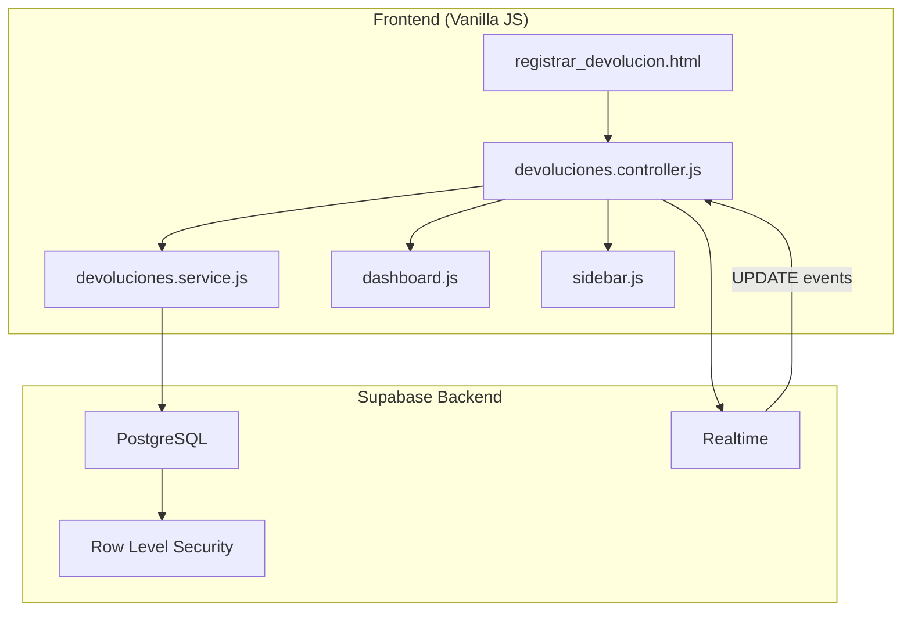
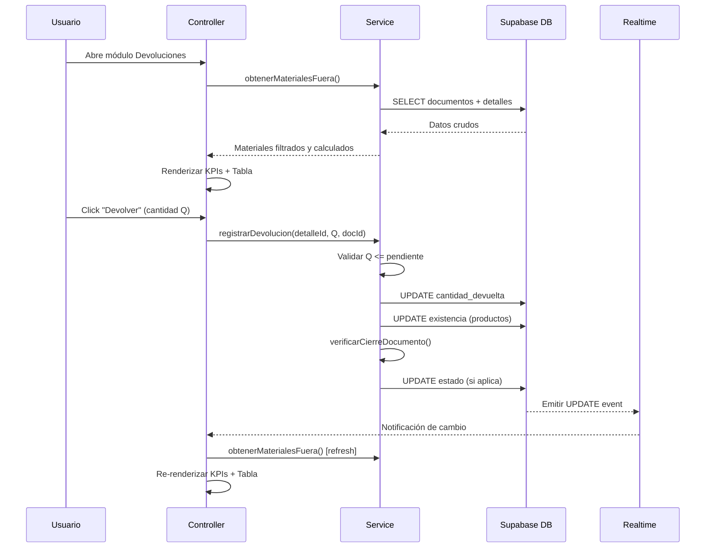
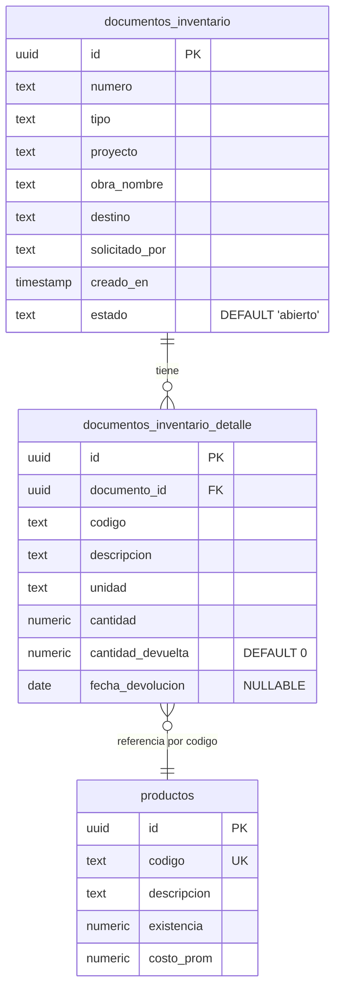

# Design Document: Devoluciones / Materiales Fuera de Almacén

## Overview

Este módulo extiende el sistema ADDBOX de inventario de obras para controlar los materiales que salen del almacén mediante Documentos de Inventario. Permite registrar devoluciones parciales o totales, calcula indicadores de materiales pendientes y vencidos, y muestra alertas visuales tanto en el módulo dedicado como en el Dashboard principal.

El diseño se basa en la arquitectura existente del proyecto: Vanilla JavaScript con patrón de capas (Service + Controller), Supabase v1 como backend (base de datos + realtime), y páginas HTML modulares.

### Decisiones de diseño clave

1. **Sin framework**: Se mantiene Vanilla JS para consistencia con el resto del proyecto.
2. **Cálculos en cliente**: `pendiente` y `dias_fuera` se calculan en el frontend (no vistas SQL) para simplicidad y compatibilidad con Supabase v1.
3. **Operaciones secuenciales**: Las actualizaciones de devolución (detalle → producto → verificar cierre) se ejecutan secuencialmente con manejo de errores en cada paso, ya que Supabase v1 no soporta transacciones del lado del cliente.
4. **Realtime v1**: Se usa la API `.on("EVENT", callback).subscribe()` de Supabase v1.

## Architecture



### Flujo de datos principal



## Components and Interfaces

### 1. Capa de Servicio (`devoluciones.service.js`)

```javascript
/**
 * @module DevolucionesService
 * Capa de lógica de negocio para el módulo de devoluciones.
 * Gestiona consultas a Supabase y operaciones de devolución.
 */

// --- Funciones públicas ---

/**
 * Obtener todos los materiales fuera de almacén (pendiente > 0).
 * @returns {Promise<MaterialFuera[]>}
 */
export async function obtenerMaterialesFuera(): Promise<MaterialFuera[]>;

/**
 * Registrar una devolución parcial o total.
 * @param {string} detalleId - ID del detalle del documento
 * @param {number} cantidadDevolver - Cantidad a devolver (Q)
 * @param {string} documentoId - ID del documento padre
 * @returns {Promise<ResultadoDevolucion>}
 * @throws {Error} Si Q <= 0 o Q > pendiente
 */
export async function registrarDevolucion(detalleId, cantidadDevolver, documentoId): Promise<ResultadoDevolucion>;

/**
 * Obtener resumen para Dashboard y Sidebar.
 * @param {number} diasLimite - Umbral de vencimiento (default: 7)
 * @returns {Promise<ResumenDevoluciones>}
 */
export async function obtenerResumenDevoluciones(diasLimite?: number): Promise<ResumenDevoluciones>;

/**
 * Obtener detalles de un documento específico para el modal.
 * @param {string} documentoId - ID del documento
 * @returns {Promise<DetalleDocumento[]>}
 */
export async function obtenerDetallesDocumento(documentoId): Promise<DetalleDocumento[]>;
```

### 2. Capa de Controlador (`devoluciones.controller.js`)

```javascript
/**
 * @module DevolucionesController
 * Capa de presentación del módulo de devoluciones.
 * Gestiona renderizado, eventos, filtros, modal y realtime.
 */

// --- Funciones principales ---
function init();                          // Inicialización del módulo
async function cargarMaterialesFuera();   // Carga y renderiza tabla + KPIs
function configurarEventos();             // Event listeners (botones, filtros)
function configurarFiltros();             // Lógica de filtrado combinado
function iniciarRealtime();               // Suscripción Supabase realtime
function destruirRealtime();              // Limpieza de suscripción

// --- KPIs ---
function calcularKPIs(materiales);        // Calcula los 4 indicadores
function renderizarKPIs(kpis);            // Actualiza DOM de cards

// --- Tabla ---
function renderizarTabla(materiales);     // Genera HTML de la tabla
function aplicarFiltros();                // Filtra materiales según criterios activos
function determinarIndicador(material);   // Retorna 🟢/🟡/🔴 según estado

// --- Modal ---
function abrirModalDevolucion(docId);     // Abre modal con detalles del documento
function cerrarModal();                   // Cierra y limpia modal
async function confirmarDevolucion();     // Procesa devolución desde modal

// --- Dashboard integration ---
export function obtenerContadoresDevoluciones(); // Expone contadores para Dashboard
```

### 3. Página HTML (`registrar_devolucion.html`)

Estructura de la página:
- Header con título del módulo
- Sección de KPI cards (4 tarjetas)
- Barra de filtros (búsqueda, tipo, estado, fechas, días)
- Tabla principal de materiales fuera
- Modal de devolución (oculto por defecto)

### 4. Integración Dashboard (`dashboard.js`)

El Dashboard importa `obtenerResumenDevoluciones` del servicio y renderiza:
- Card "Materiales fuera" con total
- Card "Materiales vencidos" con indicador rojo si > 0

### 5. Integración Sidebar (`sidebar.js`)

El Sidebar muestra un badge rojo junto al ítem "Devoluciones" cuando hay materiales vencidos.

## Data Models

### Tablas de base de datos

```sql
-- Tabla: documentos_inventario (existente, con columna nueva)
ALTER TABLE documentos_inventario
  ADD COLUMN IF NOT EXISTS estado text DEFAULT 'abierto';

-- Tabla: documentos_inventario_detalle (existente, con columnas nuevas)
ALTER TABLE documentos_inventario_detalle
  ADD COLUMN IF NOT EXISTS cantidad_devuelta numeric DEFAULT 0,
  ADD COLUMN IF NOT EXISTS fecha_devolucion date;
```

### Interfaces de datos (JavaScript)

```javascript
/**
 * @typedef {Object} MaterialFuera
 * @property {string} detalle_id - ID del registro de detalle
 * @property {string} documento_id - ID del documento padre
 * @property {string} numero - Número del documento
 * @property {string} tipo - Tipo: "Traslado" | "Requisición de materiales" | "Requisición de herramienta"
 * @property {string} proyecto - Nombre del proyecto/obra
 * @property {string} destino - Destino del material
 * @property {string} codigo - Código del producto
 * @property {string} descripcion - Descripción del producto
 * @property {string} unidad - Unidad de medida
 * @property {number} cantidad - Cantidad total despachada
 * @property {number} devuelta - Cantidad ya devuelta
 * @property {number} pendiente - cantidad - devuelta
 * @property {number} dias_fuera - Días desde creado_en hasta hoy
 * @property {string} fecha_salida - Fecha ISO de creación del documento
 * @property {string} estado_doc - "abierto" | "cerrado"
 */

/**
 * @typedef {Object} ResultadoDevolucion
 * @property {boolean} success - Si la operación fue exitosa
 * @property {string} mensaje - Mensaje descriptivo
 */

/**
 * @typedef {Object} ResumenDevoluciones
 * @property {number} totalFuera - Total de materiales fuera
 * @property {number} vencidos - Total de materiales vencidos
 * @property {number} diasPromedio - Promedio de días fuera
 * @property {number} devolucionesHoy - Devoluciones registradas hoy
 */

/**
 * @typedef {Object} FiltrosActivos
 * @property {string} busqueda - Texto de búsqueda libre
 * @property {string} tipo - Tipo de documento seleccionado
 * @property {string} estado - Estado: "pendiente" | "vencido" | "cerrado"
 * @property {string} fechaDesde - Fecha inicio del rango
 * @property {string} fechaHasta - Fecha fin del rango
 * @property {number|null} diasMin - Mínimo de días fuera
 * @property {number|null} diasMax - Máximo de días fuera
 */

/**
 * @typedef {Object} KPIs
 * @property {number} materialesFuera - Count de pendiente > 0
 * @property {number} vencidos - Count de pendiente > 0 AND dias_fuera > umbral
 * @property {number} diasPromedio - Mean de dias_fuera
 * @property {number} devolucionesHoy - Count de fecha_devolucion = hoy
 */
```

### Diagrama de relaciones



## Correctness Properties

*A property is a characteristic or behavior that should hold true across all valid executions of a system — essentially, a formal statement about what the system should do. Properties serve as the bridge between human-readable specifications and machine-verifiable correctness guarantees.*

### Property 1: Pendiente calculation correctness

*For any* Detalle_Documento with `cantidad` >= 0 and `cantidad_devuelta` >= 0, the calculated `pendiente` SHALL equal `cantidad - cantidad_devuelta`.

**Validates: Requirements 2.2**

### Property 2: Dias_Fuera calculation correctness

*For any* valid date `creado_en` that is on or before the current date, the calculated `dias_fuera` SHALL equal the number of whole days between `creado_en` and the current date.

**Validates: Requirements 2.3**

### Property 3: Materials query completeness and ordering

*For any* set of Detalle_Documento records, `obtenerMaterialesFuera()` SHALL return exactly those records where `pendiente > 0`, each containing all required fields (numero, tipo, proyecto, destino, codigo, descripcion, unidad, cantidad, devuelta, pendiente, dias_fuera), sorted by `dias_fuera` in descending order.

**Validates: Requirements 2.1, 2.4, 2.5**

### Property 4: Return validation invariant

*For any* return operation with quantity Q on a Detalle_Documento, the operation SHALL succeed if and only if `Q > 0` AND `Q <= pendiente`, and after any successful return `cantidad_devuelta` SHALL never exceed `cantidad`.

**Validates: Requirements 3.1, 11.1**

### Property 5: Return operation increments cantidad_devuelta by exactly Q

*For any* valid return of quantity Q, the resulting `cantidad_devuelta` SHALL equal the previous `cantidad_devuelta + Q`.

**Validates: Requirements 3.3**

### Property 6: Return operation increments existencia by exactly Q

*For any* valid return of quantity Q where the product code matches an existing product, the product's `existencia` SHALL increase by exactly Q and no other field in the `productos` table SHALL be modified.

**Validates: Requirements 3.5, 11.2, 11.4**

### Property 7: Document state reflects completion

*For any* Documento_Inventario, its `estado` SHALL equal "cerrado" if and only if ALL of its Detalle_Documento records have `pendiente` equal to zero. Otherwise, `estado` SHALL remain "abierto".

**Validates: Requirements 4.2, 4.3**

### Property 8: KPI calculations correctness

*For any* set of MaterialFuera records:
- "Vencidos" SHALL equal the count of records where `pendiente > 0` AND `dias_fuera > umbral`
- "Días promedio fuera" SHALL equal the arithmetic mean of `dias_fuera` across all records with `pendiente > 0`
- "Devoluciones hoy" SHALL equal the count of records where `fecha_devolucion` equals the current date

**Validates: Requirements 5.2, 5.3, 5.4**

### Property 9: Status indicator determination

*For any* table row representing a MaterialFuera:
- IF `pendiente == 0` THEN indicator SHALL be green (🟢)
- IF `pendiente > 0` AND `dias_fuera <= umbral` THEN indicator SHALL be yellow (🟡)
- IF `pendiente > 0` AND `dias_fuera > umbral` THEN indicator SHALL be red (🔴)

**Validates: Requirements 6.2, 6.3, 6.4**

### Property 10: Filter composition — intersection semantics

*For any* combination of active filters (text search, document type, status, date range, days-out range), the displayed rows SHALL be exactly the intersection of rows matching each individual filter criterion.

**Validates: Requirements 7.1, 7.2, 7.3, 7.4, 7.5, 7.6**

### Property 11: Non-modification invariant

*For any* return operation, the only fields modified SHALL be: `cantidad_devuelta` and `fecha_devolucion` in `documentos_inventario_detalle`, `existencia` in `productos`, and `estado` in `documentos_inventario`. No other fields in these tables SHALL be altered.

**Validates: Requirements 11.4, 11.5**

## Error Handling

### Errores de validación (frontend)

| Escenario | Comportamiento |
|-----------|---------------|
| Q <= 0 | Mostrar toast de error: "La cantidad debe ser mayor a cero" |
| Q > pendiente | Mostrar toast de error: "No puedes devolver más de {pendiente} unidades" |
| Input no numérico en modal | Prevenir envío, mostrar borde rojo en campo |
| Documento sin detalles pendientes | Deshabilitar botón "Devolver" |

### Errores de base de datos (servicio)

| Escenario | Comportamiento |
|-----------|---------------|
| Error en UPDATE de detalle | Lanzar error, no continuar con producto ni cierre |
| Error en UPDATE de producto | Log del error, continuar (la devolución del detalle ya se registró) |
| Error en verificación de cierre | Log del error, no afecta la devolución ya registrada |
| Producto no encontrado por código | Completar devolución sin modificar stock (silencioso) |
| Error de conexión Supabase | Mostrar toast "Error de conexión", mantener último estado visible |

### Errores de realtime

| Escenario | Comportamiento |
|-----------|---------------|
| Pérdida de conexión | Intentar re-suscripción automática al restaurar conexión |
| Evento malformado | Ignorar evento, mantener estado actual |
| Suscripción fallida | Log de advertencia, módulo funciona sin actualización automática |

## Testing Strategy

### Property-Based Tests (fast-check)

Se utilizará **fast-check** como librería de property-based testing para JavaScript. Cada propiedad del documento se implementará como un test con mínimo 100 iteraciones.

**Propiedades testeables con PBT:**
- Property 1: Cálculo de pendiente (función pura)
- Property 2: Cálculo de dias_fuera (función pura)
- Property 4: Validación de devolución (lógica de validación)
- Property 5: Incremento de cantidad_devuelta (con mock de Supabase)
- Property 7: Estado del documento (lógica de cierre)
- Property 8: Cálculos de KPIs (funciones puras)
- Property 9: Determinación de indicador de estado (función pura)
- Property 10: Composición de filtros (lógica de filtrado)

**Configuración:**
- Mínimo 100 iteraciones por test
- Tag format: `Feature: devoluciones-materiales-fuera, Property {N}: {description}`
- Generadores personalizados para MaterialFuera, DetalleDocumento, FiltrosActivos

### Unit Tests (ejemplo)

- Verificar que `obtenerMaterialesFuera()` retorna array vacío cuando no hay datos
- Verificar que el modal muestra información correcta del documento
- Verificar que el toast de éxito aparece tras devolución exitosa
- Verificar que el badge del sidebar se actualiza correctamente

### Integration Tests

- Flujo completo: crear documento → registrar devolución parcial → verificar estado abierto → devolver resto → verificar cierre
- Suscripción realtime: verificar que UPDATE en BD dispara refresh de UI
- Dashboard: verificar que cards muestran datos del servicio de devoluciones
- Producto no existente: verificar que la devolución se completa sin error

### Test Structure

```
tests/
  devoluciones/
    devoluciones.service.test.js    # PBT + unit tests del servicio
    devoluciones.controller.test.js # PBT + unit tests del controlador
    devoluciones.integration.test.js # Tests de integración
    generators.js                    # Generadores fast-check personalizados
```
