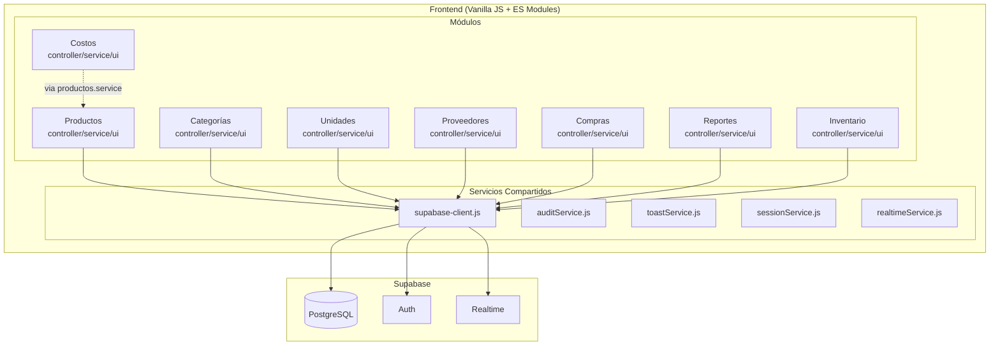
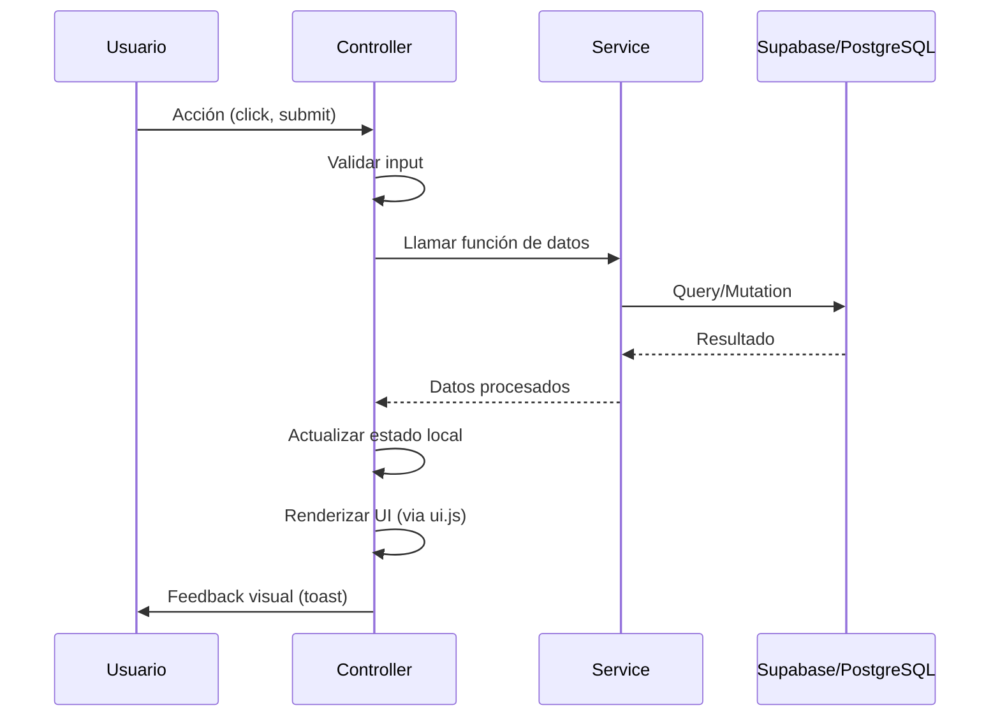
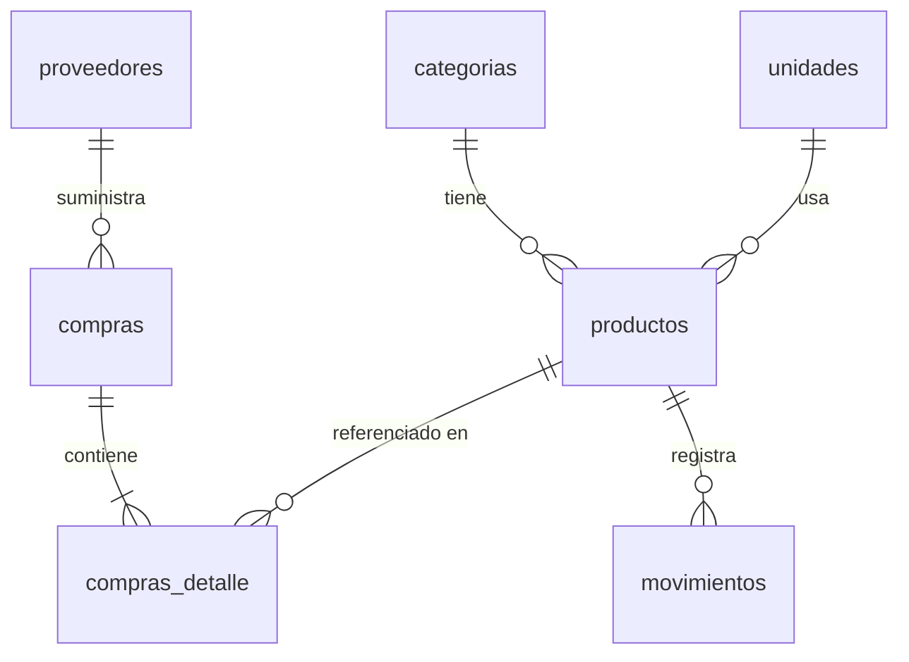

# Design Document: ERP-Lite Extension

## Overview

La extensión ERP-Lite amplía ADDBOX con módulos de gestión empresarial ligera: categorías, unidades, proveedores, compras, costos/valorización y reportes avanzados. Además, mejora el dashboard del módulo de productos con KPIs visuales y gráficas ApexCharts, y optimiza la arquitectura del módulo de inventario existente.

El diseño sigue la arquitectura modular establecida del proyecto (controller.js / service.js / ui.js) y se integra con Supabase como backend, manteniendo compatibilidad total con los flujos CRUD y modales existentes.

### Decisiones de Diseño Clave

1. **Reutilización de patrones existentes**: Cada nuevo módulo replica la estructura controller/service/ui del módulo de productos.
2. **Supabase como única fuente de datos**: Todas las operaciones de datos pasan por service.js usando el cliente Supabase CDN existente.
3. **ApexCharts para visualizaciones**: Consistente con la decisión ya tomada en el proyecto.
4. **Costo Promedio Ponderado como método de valorización**: Fórmula estándar con estructura preparada para PEPS/UEPS futuro.
5. **Validación dual**: Validación en frontend (UX inmediata) + constraints en Supabase (integridad).

## Architecture



### Flujo de Datos Principal



## Components and Interfaces

### Nuevos Módulos (Estructura de Archivos)

```
modules/
├── categorias/
│   ├── categorias.html
│   ├── categorias.controller.js
│   ├── categorias.service.js
│   └── categorias.ui.js
├── unidades/
│   ├── unidades.html
│   ├── unidades.controller.js
│   ├── unidades.service.js
│   └── unidades.ui.js
├── proveedores/
│   ├── proveedores.html
│   ├── proveedores.controller.js
│   ├── proveedores.service.js
│   └── proveedores.ui.js
├── compras/
│   ├── compras.html
│   ├── compras.controller.js
│   ├── compras.service.js
│   └── compras.ui.js
├── costos/
│   ├── costos.html
│   ├── costos.controller.js
│   ├── costos.service.js
│   └── costos.ui.js
├── reportes/
│   ├── reportes-avanzados.html
│   ├── reportes.controller.js
│   ├── reportes.service.js
│   └── reportes.ui.js
├── productos/  (modificado)
│   ├── productos.dashboard.js  (nuevo - lógica de KPIs y gráficas)
│   └── ... (archivos existentes sin cambios)
└── inventario/  (refactorizado)
    └── ... (mismos archivos, lógica reorganizada)
```

### Interfaces de Service (API Interna)

#### categorias.service.js

```javascript
export async function obtenerCategorias(): Promise<Categoria[]>
export async function obtenerCategoriasActivas(): Promise<Categoria[]>
export async function crearCategoria(payload: { nombre, descripcion?, estado? }): Promise<Categoria>
export async function actualizarCategoria(id, payload): Promise<Categoria>
export async function eliminarCategoria(id): Promise<boolean>
export async function verificarNombreUnico(nombre, excludeId?): Promise<boolean>
export async function tieneProductosAsociados(categoriaId): Promise<boolean>
```

#### unidades.service.js

```javascript
export async function obtenerUnidades(): Promise<Unidad[]>
export async function obtenerUnidadesActivas(): Promise<Unidad[]>
export async function crearUnidad(payload: { nombre, abreviatura, estado? }): Promise<Unidad>
export async function actualizarUnidad(id, payload): Promise<Unidad>
export async function eliminarUnidad(id): Promise<boolean>
export async function verificarNombreUnicoUnidad(nombre, excludeId?): Promise<boolean>
export async function tieneProductosAsociados(unidadId): Promise<boolean>
```

#### proveedores.service.js

```javascript
export async function obtenerProveedores(): Promise<Proveedor[]>
export async function obtenerProveedorPorId(id): Promise<Proveedor>
export async function crearProveedor(payload): Promise<Proveedor>
export async function actualizarProveedor(id, payload): Promise<Proveedor>
export async function eliminarProveedor(id): Promise<boolean>
export async function obtenerHistorialCompras(proveedorId, limit?): Promise<Compra[]>
export async function tieneComprasAsociadas(proveedorId): Promise<boolean>
```

#### compras.service.js

```javascript
export async function obtenerCompras(): Promise<Compra[]>
export async function obtenerCompraPorId(id): Promise<CompraConDetalle>
export async function crearCompra(payload): Promise<Compra>
export async function agregarLineaDetalle(compraId, linea): Promise<CompraDetalle>
export async function eliminarLineaDetalle(lineaId): Promise<boolean>
export async function confirmarCompra(compraId): Promise<{ success, error? }>
export async function anularCompra(compraId): Promise<{ success, error? }>
export function calcularSubtotal(cantidad, costoUnitario): number
export function calcularTotalCompra(lineas): number
export function calcularCostoPromedioPonderado(stockAnterior, costoAnterior, cantidadNueva, costoNuevo): number
export function validarLineaDetalle(linea): { valido: boolean, errores: string[] }
export function puedeEditar(estado): boolean
```

#### costos.service.js

```javascript
export async function obtenerValorizacion(): Promise<ProductoValorizado[]>
export function calcularValorizacionUnitaria(existencia, costoProm): number
export function calcularTotalGeneral(productos): number
```

#### reportes.service.js

```javascript
export async function obtenerReporteRotacion(filtros): Promise<ReporteRotacion[]>
export async function obtenerProductosMasUsados(filtros, topN?): Promise<ProductoUso[]>
export async function obtenerProductosMayorValor(filtros): Promise<ProductoValor[]>
export async function obtenerReporteAging(filtros): Promise<ProductoAging[]>
export function filtrarPorRangoFechas(datos, fechaDesde, fechaHasta): any[]
export function calcularAging(ultimoMovimiento): number
```

### Funciones Puras de Lógica de Negocio

Estas funciones son el núcleo testable del sistema y se exportan desde los respectivos service.js:

```javascript
// compras.service.js
export function calcularCostoPromedioPonderado(stockAnterior, costoAnterior, cantidadNueva, costoNuevo) {
  const totalUnidades = stockAnterior + cantidadNueva;
  if (totalUnidades === 0) return costoNuevo;
  return (stockAnterior * costoAnterior + cantidadNueva * costoNuevo) / totalUnidades;
}

export function calcularSubtotal(cantidad, costoUnitario) {
  return cantidad * costoUnitario;
}

export function calcularTotalCompra(lineas) {
  return lineas.reduce((sum, l) => sum + l.subtotal, 0);
}

export function validarLineaDetalle({ cantidad, costo_unitario }) {
  const errores = [];
  if (cantidad < 1 || cantidad > 999999) errores.push("Cantidad fuera de rango (1-999,999)");
  if (costo_unitario < 0.01 || costo_unitario > 999999999.99) errores.push("Costo fuera de rango (0.01-999,999,999.99)");
  return { valido: errores.length === 0, errores };
}

export function puedeEditar(estado) {
  return estado === "borrador";
}

// costos.service.js
export function calcularValorizacionUnitaria(existencia, costoProm) {
  return (existencia || 0) * (costoProm || 0);
}

export function calcularTotalGeneral(productos) {
  return productos.reduce((sum, p) => sum + calcularValorizacionUnitaria(p.existencia, p.costo_prom), 0);
}

// Validación compartida
export function validarCampoRequerido(valor) {
  return valor !== null && valor !== undefined && String(valor).trim().length > 0;
}

export function sonNombresIguales(nombre1, nombre2) {
  return String(nombre1).trim().toLowerCase() === String(nombre2).trim().toLowerCase();
}
```

## Data Models

### Tablas Nuevas en Supabase

#### categorias

| Campo | Tipo | Constraints |
|-------|------|-------------|
| id | uuid | PK, default gen_random_uuid() |
| nombre | varchar(100) | NOT NULL, UNIQUE (case-insensitive) |
| descripcion | varchar(255) | nullable |
| estado | varchar(10) | NOT NULL, CHECK ('activo','inactivo'), default 'activo' |
| creado_en | timestamptz | default now() |
| actualizado_en | timestamptz | default now() |

#### unidades

| Campo | Tipo | Constraints |
|-------|------|-------------|
| id | uuid | PK, default gen_random_uuid() |
| nombre | varchar(50) | NOT NULL, UNIQUE |
| abreviatura | varchar(10) | NOT NULL |
| estado | varchar(10) | NOT NULL, CHECK ('activo','inactivo'), default 'activo' |
| creado_en | timestamptz | default now() |
| actualizado_en | timestamptz | default now() |

#### proveedores

| Campo | Tipo | Constraints |
|-------|------|-------------|
| id | uuid | PK, default gen_random_uuid() |
| nombre | varchar(150) | NOT NULL |
| rif | varchar(20) | NOT NULL |
| telefono | varchar(20) | nullable |
| email | varchar(100) | nullable |
| direccion | varchar(300) | nullable |
| estado | varchar(10) | NOT NULL, CHECK ('activo','inactivo'), default 'activo' |
| creado_en | timestamptz | default now() |

#### compras

| Campo | Tipo | Constraints |
|-------|------|-------------|
| id | uuid | PK, default gen_random_uuid() |
| proveedor_id | uuid | FK → proveedores(id), NOT NULL |
| fecha | date | NOT NULL, default current_date |
| estado | varchar(15) | NOT NULL, CHECK ('borrador','confirmado','anulado'), default 'borrador' |
| total | numeric(12,2) | default 0 |
| creado_en | timestamptz | default now() |

#### compras_detalle

| Campo | Tipo | Constraints |
|-------|------|-------------|
| id | uuid | PK, default gen_random_uuid() |
| compra_id | uuid | FK → compras(id), NOT NULL |
| producto_id | uuid | FK → productos(id), NOT NULL |
| cantidad | integer | NOT NULL, CHECK (1-999999) |
| costo_unitario | numeric(12,2) | NOT NULL, CHECK (0.01-999999999.99) |
| subtotal | numeric(14,2) | NOT NULL (computed: cantidad × costo_unitario) |

### Modificaciones a Tablas Existentes

#### productos (columnas nuevas)

| Campo | Tipo | Constraints |
|-------|------|-------------|
| categoria_id | uuid | FK → categorias(id), nullable |
| unidad_id | uuid | FK → unidades(id), nullable |

### Relaciones



## Correctness Properties

*A property is a characteristic or behavior that should hold true across all valid executions of a system—essentially, a formal statement about what the system should do. Properties serve as the bridge between human-readable specifications and machine-verifiable correctness guarantees.*

### Property 1: KPI Calculation Correctness

*For any* array of products with arbitrary existencia, costo_prom, umbral_critico, and estado values, the KPI calculations SHALL produce: total = array length, activos = count where estado === "activo", criticos = count where existencia < (umbral_critico || 5) AND estado === "activo", and valor_total = sum of (costo_prom × existencia) for all products.

**Validates: Requirements 1.1**

### Property 2: Chart Data Distribution Integrity

*For any* array of products with categories and estados, the chart data preparation SHALL produce: category distribution where the sum of all category counts equals total products, estado distribution where activos + inactivos equals total products, and top 5 by value correctly sorted descending by (costo_prom × existencia).

**Validates: Requirements 1.2**

### Property 3: Category Filter Correctness

*For any* array of products and any selected category, filtering SHALL return only products whose category matches the selection; and the set of unique categories extracted from products SHALL equal the distinct non-null category values present in the array.

**Validates: Requirements 1.3, 1.7**

### Property 4: Required Field Validation

*For any* string value submitted as a required field (nombre in categorías, nombre/abreviatura in unidades, nombre/rif in proveedores), if the value is null, undefined, empty, or composed entirely of whitespace characters, the validation function SHALL reject it and return an error indicating the field is required.

**Validates: Requirements 2.2, 3.2, 3.3, 4.2**

### Property 5: Name Uniqueness Detection (Case-Insensitive)

*For any* two name strings, the uniqueness check SHALL detect them as duplicates if and only if they are equal after applying trim() and toLowerCase() to both strings.

**Validates: Requirements 2.3, 3.7**

### Property 6: Input Trim Sanitization

*For any* input string with arbitrary leading and trailing whitespace, the sanitization function SHALL produce output equal to input.trim(), preserving all internal content.

**Validates: Requirements 2.4**

### Property 7: Active Catalog Items Sorted Alphabetically

*For any* array of catalog items (categorías or unidades) with mixed estado values, the select population function SHALL return only items where estado === "activo", sorted alphabetically by nombre (case-insensitive).

**Validates: Requirements 2.5, 3.4**

### Property 8: Referential Integrity Prevents Deletion

*For any* catalog entity (categoría, unidad, or proveedor) that has at least one referencing record (producto or compra), the deletion function SHALL reject the operation; and for any entity with zero references, deletion SHALL succeed.

**Validates: Requirements 2.7, 3.6, 4.5**

### Property 9: Purchase History Sorted and Limited

*For any* set of purchases associated with a supplier, the history query SHALL return them sorted by fecha descending and limited to a maximum of 50 records.

**Validates: Requirements 4.4**

### Property 10: Purchase Line Range Validation

*For any* purchase detail line, the validation function SHALL accept it if and only if cantidad is an integer in [1, 999999] AND costo_unitario is a number in [0.01, 999999999.99]; otherwise it SHALL reject with an error indicating the invalid field.

**Validates: Requirements 5.2, 5.11**

### Property 11: Purchase Subtotal and Total Calculation

*For any* set of purchase detail lines with valid cantidad and costo_unitario, the subtotal of each line SHALL equal cantidad × costo_unitario, and the purchase total SHALL equal the sum of all line subtotals.

**Validates: Requirements 5.3**

### Property 12: Stock Update on Purchase Confirmation

*For any* purchase in estado "borrador" with N detail lines, upon confirmation, each referenced product's stock SHALL increase by exactly the cantidad specified in its corresponding line.

**Validates: Requirements 5.4**

### Property 13: Weighted Average Cost Calculation

*For any* product with stock_anterior ≥ 0, costo_anterior ≥ 0, and a purchase line with cantidad_nueva > 0 and costo_unitario > 0, the new costo_prom SHALL equal (stock_anterior × costo_anterior + cantidad_nueva × costo_unitario) / (stock_anterior + cantidad_nueva). If stock_anterior + cantidad_nueva equals 0, costo_prom SHALL equal costo_unitario.

**Validates: Requirements 5.5**

### Property 14: Edit Disabled for Non-Draft Purchases

*For any* purchase with estado "confirmado" or "anulado", the puedeEditar function SHALL return false; for estado "borrador" it SHALL return true.

**Validates: Requirements 5.8**

### Property 15: Draft Annulment Preserves Stock

*For any* purchase in estado "borrador" with any number of detail lines, anulación SHALL change estado to "anulado" without modifying the existencia or costo_prom of any referenced product.

**Validates: Requirements 5.9**

### Property 16: Confirmed Annulment Reverses Stock

*For any* purchase in estado "confirmado" with N detail lines, anulación SHALL decrease each referenced product's stock by exactly the cantidad of its line, effectively reversing the confirmation operation.

**Validates: Requirements 5.10**

### Property 17: Valorización Calculation

*For any* array of products with arbitrary existencia and costo_prom values (including null and 0), the valorización of each product SHALL equal (existencia || 0) × (costo_prom || 0), and the total general SHALL equal the sum of all individual valorizaciones.

**Validates: Requirements 6.1, 6.2, 6.6**

### Property 18: Report Date Range Filtering

*For any* set of movements with timestamps and any date range [fechaDesde, fechaHasta], the filtered result SHALL contain only movements whose creado_en falls within the inclusive range; if no range is specified, the default SHALL be the last 30 calendar days.

**Validates: Requirements 7.1**

### Property 19: Top N Sorting and Limiting

*For any* set of products/movements and a value N in [5, 50], the top-N function SHALL return at most N items sorted descending by the specified metric (movement count or valorización), and every excluded item SHALL have a metric value less than or equal to the minimum value in the returned set.

**Validates: Requirements 7.2, 7.3**

### Property 20: Aging Calculation and Sorting

*For any* set of products with last movement dates, the aging value SHALL equal the number of days between the current date and the product's last movement date (creado_en from movimientos table), and the results SHALL be sorted descending by aging value (most stale first).

**Validates: Requirements 7.4**

### Property 21: Multi-Filter Intersection

*For any* dataset and any combination of filters (fecha, categoría, proveedor), the filtered result SHALL contain only records that satisfy ALL applied filters simultaneously (logical AND), and every record in the original dataset that satisfies all filters SHALL appear in the result.

**Validates: Requirements 7.6**

## Error Handling

### Estrategia General

Cada módulo sigue el patrón de manejo de errores establecido en el proyecto:

1. **Validación frontend** (controller.js): Validar inputs antes de enviar al service. Mostrar errores inmediatos via `showToast(mensaje, "error")`.
2. **Errores de service** (service.js): Capturar errores de Supabase, lanzar excepciones con mensajes descriptivos.
3. **Errores de red/timeout**: Mostrar toast genérico "Error de conexión" y mantener el estado anterior.
4. **Errores de integridad referencial**: Capturar errores FK de Supabase y traducir a mensajes amigables.

### Casos Específicos por Módulo

| Módulo | Error | Manejo |
|--------|-------|--------|
| Categorías | Nombre duplicado | Toast: "El nombre de categoría ya existe" |
| Categorías | Eliminar con productos | Toast: "No se puede eliminar: tiene productos asignados" |
| Unidades | Nombre duplicado | Toast: "El nombre de unidad ya está registrado" |
| Unidades | Eliminar con productos | Toast: "No se puede eliminar: la unidad está en uso" |
| Proveedores | Eliminar con compras | Toast: "No se puede eliminar: existen compras vinculadas" |
| Compras | Confirmar sin líneas | Toast: "La compra debe tener al menos un producto" |
| Compras | Línea fuera de rango | Toast: "Cantidad/Costo fuera del rango permitido" |
| Compras | Editar confirmada/anulada | Botones deshabilitados + Toast si se intenta |
| Costos | Sin productos | Mensaje en tabla: "No hay datos de valorización" + total = 0 |
| Reportes | Sin resultados | Mensaje: "No se encontraron resultados" + gráficos vacíos |

### Patrón de Try/Catch en Controllers

```javascript
async function handleOperacion() {
  try {
    // Validación frontend
    const errores = validar(payload);
    if (errores.length > 0) {
      showToast(errores[0], "error");
      return;
    }
    // Operación
    const resultado = await serviceFn(payload);
    showToast("Operación exitosa", "success");
    await recargarDatos();
  } catch (err) {
    showToast("Error: " + err.message, "error");
  }
}
```

## Testing Strategy

### Enfoque Dual: Unit Tests + Property-Based Tests

El proyecto utiliza vanilla JS sin bundler, por lo que las pruebas se ejecutan con **Vitest** (compatible con ES modules) y **fast-check** para property-based testing.

### Unit Tests (Example-Based)

Cubren escenarios específicos, integraciones y edge cases:

- **Integración CRUD**: Verificar que cada módulo puede crear, leer, actualizar y eliminar registros correctamente contra Supabase (con mocks).
- **UI rendering**: Verificar que las funciones de renderizado producen HTML correcto para datos conocidos.
- **Edge cases**: Productos con costo_prom null/0, compras sin líneas, arrays vacíos.
- **Flujos de estado**: Transiciones borrador→confirmado→anulado en compras.
- **Realtime**: Verificar que los callbacks de suscripción actualizan la UI.

### Property-Based Tests (fast-check)

Cada propiedad del documento de Correctness Properties se implementa como un test con mínimo 100 iteraciones:

```javascript
import { fc } from "fast-check";
import { describe, it, expect } from "vitest";

// Feature: erp-lite-extension, Property 13: Weighted Average Cost Calculation
describe("Costo Promedio Ponderado", () => {
  it("calcula correctamente para cualquier combinación válida de stock y costos", () => {
    fc.assert(
      fc.property(
        fc.nat(),           // stockAnterior
        fc.float({ min: 0, noNaN: true }), // costoAnterior
        fc.integer({ min: 1, max: 999999 }), // cantidadNueva
        fc.float({ min: 0.01, noNaN: true }), // costoNuevo
        (stockAnterior, costoAnterior, cantidadNueva, costoNuevo) => {
          const resultado = calcularCostoPromedioPonderado(
            stockAnterior, costoAnterior, cantidadNueva, costoNuevo
          );
          const esperado = (stockAnterior * costoAnterior + cantidadNueva * costoNuevo)
            / (stockAnterior + cantidadNueva);
          expect(resultado).toBeCloseTo(esperado, 5);
        }
      ),
      { numRuns: 100 }
    );
  });
});
```

### Configuración de Tests

- **Framework**: Vitest (ES modules nativo, rápido, compatible con fast-check)
- **PBT Library**: fast-check
- **Mocking**: vitest mocks para supabase-client.js
- **Iteraciones PBT**: Mínimo 100 por propiedad
- **Tag format**: `Feature: erp-lite-extension, Property {N}: {título}`

### Cobertura por Tipo

| Tipo | Propiedades | Estrategia |
|------|-------------|------------|
| Cálculos puros | 1, 2, 11, 13, 17 | PBT con generadores numéricos |
| Validación de inputs | 4, 5, 6, 10 | PBT con generadores de strings |
| Filtrado/Ordenamiento | 3, 7, 9, 18, 19, 20, 21 | PBT con generadores de arrays |
| Lógica de estado | 8, 12, 14, 15, 16 | PBT con generadores de objetos |
| CRUD/Integración | 2.1, 3.1, 4.1, 5.1, 5.6 | Unit tests con mocks |
| UI/Rendering | 1.5, 1.6, 6.4, 7.5 | Unit tests + snapshot |
| Arquitectura | 8.1-8.4 | Smoke tests / code review |
