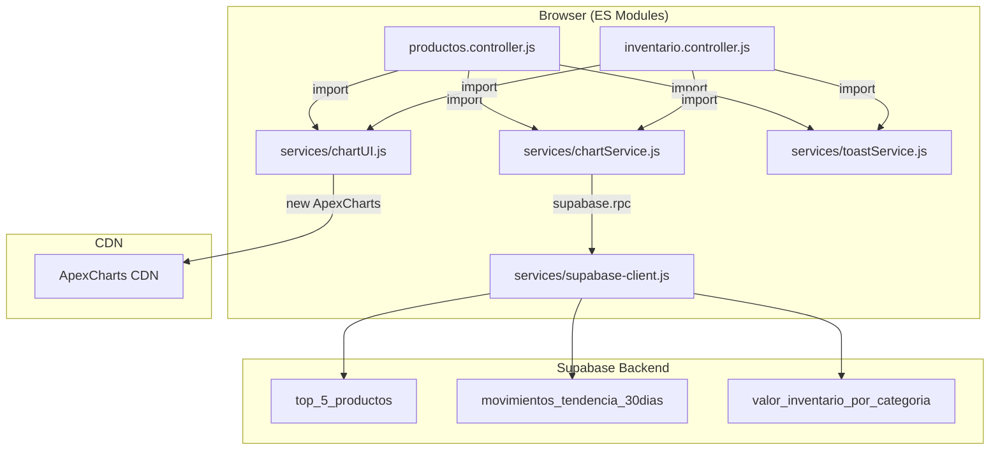

# Design Document: Feature Pack Charts

## Overview

This feature adds three analytical charts — Top 5 Productos (donut), Tendencia de Movimientos (line), and Valor de Inventario por Categoría (horizontal bar) — to both the Productos and Inventario modules. The charts are powered by ApexCharts via CDN, follow the existing RPC → Service → Controller → UI → HTML layered architecture, and are role-gated to authorized users (almacenista, jefe, administrador).

Two new shared ES modules are introduced:
- `services/chartService.js` — data layer that calls Supabase RPCs and normalizes responses into `{label, value}` datasets
- `services/chartUI.js` — rendering layer that instantiates ApexCharts given a dataset and a DOM container

Both controllers (`productos.controller.js`, `inventario.controller.js`) import from these shared modules, ensuring zero code duplication.

## Architecture



**Design Decisions:**

1. **Shared modules over per-module duplication** — A single `chartService.js` and `chartUI.js` avoids maintaining identical logic in two places. Both controllers import from the same path.
2. **ApexCharts via CDN (global)** — The library is loaded as a `<script>` tag before the controller module. The UI layer checks `typeof ApexCharts === "undefined"` as a guard, displaying a fallback message if unavailable.
3. **Independent fetch per chart** — Each chart's data is fetched with its own `try/catch` so that a failure in one does not block the others or the rest of the page.
4. **Role gating at controller level** — The controller checks the user's role before rendering the charts section. Unauthorized roles see `display: none` on the charts wrapper.

## Components and Interfaces

### chartService.js (`services/chartService.js`)

```typescript
// Public API
export async function getTop5Productos(): Promise<Dataset>
export async function getTendenciaMovimientos(): Promise<Dataset>
export async function getValorInventarioPorCategoria(): Promise<Dataset>

// Dataset type (conceptual, not enforced at runtime)
type Dataset = Array<{ label: string; value: number }>
```

| Function | RPC Called | Normalization Rules |
|----------|-----------|-------------------|
| `getTop5Productos()` | `top_5_productos()` | `nombre→label` (fallback "Sin nombre"), `cantidad→value` (trunc, min 0), max 5 items, descending by value |
| `getTendenciaMovimientos()` | `movimientos_tendencia_30dias()` | `fecha→label` (ISO "YYYY-MM-DD"), `total→value` (number), exclude rows with null fecha/total, max 30 items, ascending by date |
| `getValorInventarioPorCategoria()` | `valor_inventario_por_categoria()` | `categoria→label` (fallback "Sin categoría"), `valor→value` (round 2 decimals, min 0) |

### chartUI.js (`services/chartUI.js`)

```typescript
export function renderGraficaTop5Productos(dataset: Dataset | null | undefined): void
export function renderGraficaTendenciaMovimientos(dataset: Dataset | null | undefined): void
export function renderGraficaValorInventarioPorCategoria(dataset: Dataset | null | undefined): void
```

Each render function:
1. Checks ApexCharts availability → fallback message if missing
2. Validates dataset → "No hay datos" if empty/null/undefined
3. Destroys any existing chart instance in the target container
4. Constructs ApexCharts options with animation (easing, ≤800ms)
5. Instantiates and renders the chart

| Function | Chart Type | Container ID | Special Behavior |
|----------|-----------|-------------|-----------------|
| `renderGraficaTop5Productos` | donut | `#chart-top5-productos` | Consistent color palette via deterministic hash, labels truncated at 20 chars |
| `renderGraficaTendenciaMovimientos` | line | `#chart-tendencia-movimientos` | Smooth curve, tooltip with date + value |
| `renderGraficaValorInventarioPorCategoria` | bar (horizontal) | `#chart-valor-por-categoria` | Sorted descending, max 50 categories, labels truncated at 20 chars, values formatted as "$X,XXX.XX" (es-MX) |

### Controller Integration

Both `productos.controller.js` and `inventario.controller.js` follow the same orchestration pattern:

```javascript
import { getTop5Productos, getTendenciaMovimientos, getValorInventarioPorCategoria } from "../../services/chartService.js";
import { renderGraficaTop5Productos, renderGraficaTendenciaMovimientos, renderGraficaValorInventarioPorCategoria } from "../../services/chartUI.js";

async function cargarGraficas() {
  // Role check
  if (!AUTHORIZED_ROLES.includes(rolUsuario)) {
    document.getElementById("charts-section").style.display = "none";
    return;
  }

  // Independent fetches — failure in one does not block others
  const fetches = [
    { fetch: getTop5Productos, render: renderGraficaTop5Productos, name: "Top 5 Productos" },
    { fetch: getTendenciaMovimientos, render: renderGraficaTendenciaMovimientos, name: "Tendencia Movimientos" },
    { fetch: getValorInventarioPorCategoria, render: renderGraficaValorInventarioPorCategoria, name: "Valor por Categoría" },
  ];

  await Promise.allSettled(fetches.map(async ({ fetch, render, name }) => {
    try {
      const dataset = await fetch();
      render(dataset);
    } catch (err) {
      showToast(`Error cargando ${name}: ${err.message}`, "error");
    }
  }));
}
```

### HTML Structure (both pages)

```html
<!-- After KPIs section, before product/stock table -->
<section id="charts-section" class="charts-section" style="margin-bottom:24px;">
  <div class="charts-grid">
    <div class="chart-box">
      <h3>Top 5 Productos por Stock</h3>
      <div id="chart-top5-productos" style="min-height:280px;"></div>
    </div>
    <div class="chart-box">
      <h3>Tendencia de Movimientos (30 días)</h3>
      <div id="chart-tendencia-movimientos" style="min-height:280px;"></div>
    </div>
    <div class="chart-box">
      <h3>Valor de Inventario por Categoría</h3>
      <div id="chart-valor-por-categoria" style="min-height:280px;"></div>
    </div>
  </div>
</section>
```

## Data Models

### RPC Response Shapes (from Supabase PostgreSQL functions)

```sql
-- top_5_productos() returns TABLE(nombre text, cantidad numeric)
-- movimientos_tendencia_30dias() returns TABLE(fecha date, total numeric)
-- valor_inventario_por_categoria() returns TABLE(categoria text, valor numeric)
```

### Normalized Dataset (internal)

```typescript
interface DatasetItem {
  label: string;  // Display label (product name, date, category)
  value: number;  // Numeric value (quantity, total, monetary value)
}

type Dataset = DatasetItem[];
```

### Chart Instance Tracking

Each render function maintains a module-scoped reference to the current chart instance per container, enabling proper cleanup:

```javascript
// Module-level state in chartUI.js
let chartInstances = {
  "chart-top5-productos": null,
  "chart-tendencia-movimientos": null,
  "chart-valor-por-categoria": null,
};
```

## Correctness Properties

*A property is a characteristic or behavior that should hold true across all valid executions of a system — essentially, a formal statement about what the system should do. Properties serve as the bridge between human-readable specifications and machine-verifiable correctness guarantees.*

### Property 1: Top 5 data normalization

*For any* array of RPC rows `{nombre, cantidad}` (0 to N items), `getTop5Productos()` SHALL return a Dataset where: (a) the array length is at most 5, (b) every `value` is a non-negative integer (truncated, min 0), (c) every `label` is a non-empty string (defaulting to "Sin nombre" for null/undefined nombre), and (d) items are sorted by `value` in descending order.

**Validates: Requirements 1.1, 1.2, 1.5**

### Property 2: Tendencia data normalization

*For any* array of RPC rows `{fecha, total}` (0 to N items), `getTendenciaMovimientos()` SHALL return a Dataset where: (a) rows with null/undefined fecha or total are excluded, (b) the array length is at most 30, (c) every `label` is a valid ISO date string "YYYY-MM-DD", (d) every `value` is a number, and (e) items are sorted by `label` in ascending chronological order.

**Validates: Requirements 3.1, 3.2, 3.5**

### Property 3: Category value normalization

*For any* array of RPC rows `{categoria, valor}` (0 to N items), `getValorInventarioPorCategoria()` SHALL return a Dataset where: (a) every `label` is a non-empty string (defaulting to "Sin categoría" for null/undefined), (b) every `value` is a non-negative number rounded to exactly 2 decimal places, and (c) negative `valor` inputs produce `value` of 0.

**Validates: Requirements 5.1, 5.2, 5.5**

### Property 4: Label truncation

*For any* string used as a chart label, if the string length exceeds 20 characters, the displayed label SHALL be the first 20 characters followed by "…"; otherwise the label SHALL be unchanged.

**Validates: Requirements 2.4, 6.2**

### Property 5: Consistent color assignment

*For any* dataset item label, the color assigned by the deterministic hash function SHALL always produce the same color from the predefined palette across multiple invocations, regardless of the dataset's order or size.

**Validates: Requirements 2.3**

### Property 6: Bar chart sorting and category limit

*For any* valid Dataset passed to `renderGraficaValorInventarioPorCategoria()`, the data provided to ApexCharts SHALL be sorted by value in descending order and limited to at most 50 categories (discarding the lowest-value items beyond that limit).

**Validates: Requirements 6.1**

### Property 7: Monetary formatting

*For any* non-negative number, the bar chart value formatter SHALL produce a string matching the pattern `$` followed by a locale-formatted number (es-MX) with exactly 2 decimal places.

**Validates: Requirements 6.3**

### Property 8: Role gating hides charts for unauthorized roles

*For any* user role that is NOT in the set {almacenista, jefe, administrador}, the charts section container SHALL have `display: none` applied, making all chart containers and headings invisible.

**Validates: Requirements 7.3, 8.3**

## Error Handling

| Scenario | Behavior |
|----------|----------|
| RPC returns error | `chartService` throws Error with RPC message; controller catches and calls `showToast(message, "error")` |
| RPC returns empty data | `chartService` returns `[]`; `chartUI` renders "No hay datos" message |
| ApexCharts CDN fails to load | `chartUI` detects `typeof ApexCharts === "undefined"` and renders "La gráfica no pudo ser cargada" |
| One chart fetch fails | Other charts and all non-chart page functionality continue unaffected |
| Shared module import fails | Controller's chart initialization halts; non-chart features (KPIs, tables, search, modals) remain functional |
| Dataset contains unexpected null/undefined fields | `chartService` applies fallback values ("Sin nombre", "Sin categoría", 0) per normalization rules |

**Error isolation principle:** Each chart operates independently. A `Promise.allSettled` pattern ensures that failures are contained per-chart. The controller never awaits all charts as a single blocking operation.

## Testing Strategy

### Property-Based Tests (fast-check)

The project will use [fast-check](https://github.com/dubzzz/fast-check) for property-based testing. Each property test runs a minimum of 100 iterations with randomly generated inputs.

**Library:** `fast-check` (npm)
**Runner:** Vitest (or any ES module-compatible test runner)
**Minimum iterations:** 100 per property

| Property | Module Under Test | Generator Strategy |
|----------|------------------|-------------------|
| Property 1: Top 5 normalization | `chartService.js` | Random arrays of `{nombre: arb string/null, cantidad: arb number/null}` (0–20 items) |
| Property 2: Tendencia normalization | `chartService.js` | Random arrays of `{fecha: arb date/null, total: arb number/null}` (0–50 items) |
| Property 3: Category normalization | `chartService.js` | Random arrays of `{categoria: arb string/null, valor: arb number/null}` (0–100 items) |
| Property 4: Label truncation | `chartUI.js` | Random strings of length 0–100 |
| Property 5: Color consistency | `chartUI.js` | Random strings, called twice per input |
| Property 6: Bar chart sorting/limit | `chartUI.js` | Random datasets of 1–100 items with arb values |
| Property 7: Monetary formatting | `chartUI.js` | Random non-negative floats |
| Property 8: Role gating | Controller logic | Random role strings (mix of authorized and unauthorized) |

**Tag format:** Each test is annotated with:
```javascript
// Feature: feature-pack-charts, Property N: <property text>
```

### Unit Tests (example-based)

| Test | What it verifies |
|------|-----------------|
| RPC error → thrown Error | Req 1.3, 3.3, 5.3 |
| Empty RPC → empty array | Req 1.4, 3.4, 5.4 |
| Empty/null dataset → "No hay datos" | Req 2.6, 4.5, 6.5 |
| ApexCharts undefined → fallback message | Req 2.7, 4.6, 6.6 |
| Existing chart destroyed before re-render | Req 2.2, 4.7 |
| Animation config (easing, ≤800ms) | Req 2.5, 4.4, 6.4 |
| Line chart uses smooth curve | Req 4.2 |
| Tooltip shows label + value | Req 4.3 |
| DOM order of chart containers | Req 10.1–10.6 |
| Container min-height 280px | Req 10.7 |
| Unique container IDs | Req 10.8 |
| Script tag order (ApexCharts CDN after Supabase, before controller) | Req 7.6, 8.6 |
| Module exports exactly 3 functions each | Req 9.3, 9.4 |

### Integration Tests

| Test | What it verifies |
|------|-----------------|
| One chart fetch failure does not block others | Req 7.5, 8.5 |
| Module import failure does not break non-chart features | Req 9.7 |
| Controller calls all three fetches independently | Req 7.1, 8.1 |
