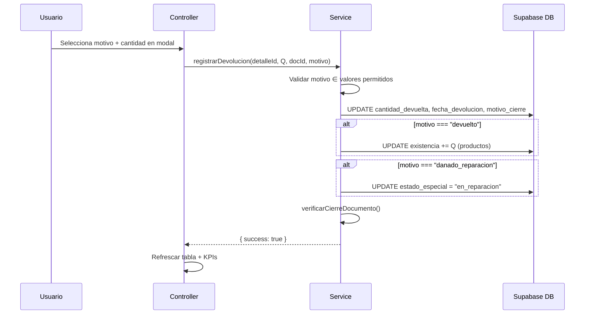

# Design Document: Motivo de Cierre para Materiales Fuera

## Overview

Esta feature extiende el módulo de Devoluciones existente para soportar múltiples motivos de cierre. Actualmente `registrarDevolucion()` siempre incrementa stock. Con este cambio, el usuario selecciona un motivo y solo "devuelto" modifica existencias. Los demás motivos (consumido, extraviado, dañado-baja, dañado-reparación) cierran el pendiente sin tocar stock.

### Decisiones de diseño clave

1. **Retrocompatible**: Si no se pasa motivo, se asume "devuelto" (comportamiento actual).
2. **Sin tabla nueva**: Se agregan 2 columnas a `documentos_inventario_detalle`.
3. **Motivo por línea**: Cada producto en un documento puede tener un motivo diferente.
4. **Estado especial**: Solo "danado_reparacion" activa `estado_especial = "en_reparacion"`.

## Architecture

No cambia la arquitectura. Se modifica:
- `devoluciones-setup.sql` — 2 columnas nuevas
- `devoluciones.service.js` — parámetro `motivo` en `registrarDevolucion()`
- `devoluciones.controller.js` — select en modal, envío de motivo
- `registrar_devolucion.html` — select en modal table



## Components and Interfaces

### Service Layer — Cambios a `registrarDevolucion()`

```javascript
/**
 * Registrar cierre de un material con motivo.
 * @param {string} detalleId
 * @param {number} cantidadDevolver - Q
 * @param {string} documentoId
 * @param {string} [motivo="devuelto"] - Motivo de cierre
 * @returns {Promise<ResultadoDevolucion>}
 */
export async function registrarDevolucion(detalleId, cantidadDevolver, documentoId, motivo = "devuelto")
```

### Controller — Cambios al modal

```javascript
// En confirmarDevolucion():
// Leer el select de motivo por cada fila del modal
const motivo = input.closest("tr").querySelector(".select-motivo")?.value || "devuelto";
await registrarDevolucion(dev.detalleId, dev.cantidad, dev.docId, motivo);
```

### HTML — Select en modal table

```html
<select class="select-motivo">
  <option value="devuelto" selected>Devuelto</option>
  <option value="consumido">Consumido</option>
  <option value="extraviado">Extraviado</option>
  <option value="danado_baja">Dañado - Baja</option>
  <option value="danado_reparacion">Dañado - Reparación</option>
</select>
```

## Data Models

### Columnas nuevas

```sql
ALTER TABLE documentos_inventario_detalle
  ADD COLUMN IF NOT EXISTS motivo_cierre text,
  ADD COLUMN IF NOT EXISTS estado_especial text;
```

### Valores permitidos

| Campo | Valores |
|-------|---------|
| `motivo_cierre` | "devuelto", "consumido", "extraviado", "danado_baja", "danado_reparacion" |
| `estado_especial` | "en_reparacion", NULL |

### Reglas de stock por motivo

| Motivo | Incrementa existencia | estado_especial |
|--------|----------------------|-----------------|
| devuelto | ✅ Sí (+Q) | NULL |
| consumido | ❌ No | NULL |
| extraviado | ❌ No | NULL |
| danado_baja | ❌ No | NULL |
| danado_reparacion | ❌ No | "en_reparacion" |

## Correctness Properties

### Property 1: Stock modification only for "devuelto"

*For any* closure operation with motivo M and quantity Q: `existencia` SHALL increase by Q if and only if M === "devuelto". For all other motivos, `existencia` SHALL remain unchanged.

**Validates: Requirements 2.1, 2.2, 2.3, 2.4, 2.5**

### Property 2: Pending always closes

*For any* valid closure operation regardless of motivo, `cantidad_devuelta` SHALL increase by Q and `pendiente` SHALL decrease by Q.

**Validates: Requirements 2.7**

### Property 3: estado_especial only for reparacion

*For any* closure operation, `estado_especial` SHALL equal "en_reparacion" if and only if motivo === "danado_reparacion". For all other motivos, `estado_especial` SHALL remain NULL.

**Validates: Requirements 2.6**

### Property 4: motivo_cierre always persisted

*For any* valid closure operation, the `motivo_cierre` field SHALL be set to the provided motivo value.

**Validates: Requirements 2.9**

### Property 5: Motivo validation

*For any* closure operation with an invalid motivo (not in the 5 allowed values), the operation SHALL be rejected.

**Validates: Requirements 2.10**

## Error Handling

| Escenario | Comportamiento |
|-----------|---------------|
| Motivo no válido | Lanzar error: "Motivo de cierre no válido" |
| Motivo vacío/null | Usar "devuelto" como default (retrocompatible) |
| Select sin selección en modal | Prevenir envío, mostrar error de validación |

## Testing Strategy

Property-based tests con fast-check:
- Property 1: Stock solo se modifica con "devuelto"
- Property 2: Pendiente siempre se cierra
- Property 3: estado_especial solo con "danado_reparacion"
- Property 4: motivo_cierre siempre se persiste
- Property 5: Motivos inválidos son rechazados
