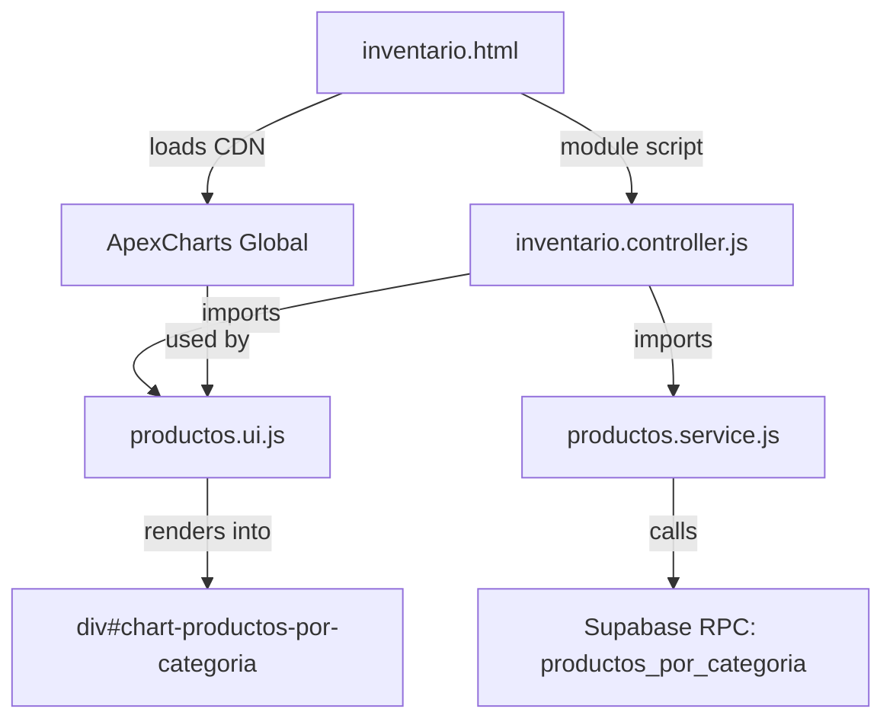

# Design Document: Move Chart to Inventario

## Overview

This design describes the migration of the "Productos por categoría" bar chart from the admin-dashboard Productos module (`modules/productos/`) to the Inventario module (`modules/inventario/`). The chart visualizes product counts grouped by category using ApexCharts and fetches data from the `productos_por_categoria` Supabase RPC function.

The migration follows a **reuse-by-import** strategy: the existing service (`getProductosPorCategoria`) and UI rendering (`renderGraficaProductosPorCategoria`) functions remain in `productos.service.js` and `productos.ui.js` respectively, and the Inventario controller imports them directly. After migration, all chart-related HTML, script tags, and controller invocations are removed from the Productos module.

### Key Design Decisions

1. **No code duplication**: The Inventario controller imports existing functions rather than copying them. This keeps maintenance centralized in the Productos service/UI layer.
2. **CDN script placement**: ApexCharts CDN is added to `inventario.html` as a non-module `<script>` tag before the controller module script, ensuring the global `ApexCharts` constructor is available when the controller executes.
3. **Graceful degradation**: If ApexCharts fails to load or the RPC call fails, the chart container shows a user-friendly fallback message without breaking other page functionality.
4. **Role-gated rendering**: The chart loading function is only invoked for authorized roles (almacenista, jefe, administrador), preventing unnecessary RPC calls for unauthorized users.

## Architecture

The feature follows the existing layered architecture of the admin-dashboard:



### Data Flow

1. `inventario.html` loads ApexCharts CDN (non-module script, global availability)
2. `inventario.controller.js` initializes on `DOMContentLoaded`
3. Controller checks user role via existing session/profile logic
4. If role is authorized, controller calls `getProductosPorCategoria()` from `productos.service.js`
5. Service calls Supabase RPC `productos_por_categoria`, transforms response to `{label, value}[]`
6. Controller passes dataset to `renderGraficaProductosPorCategoria(dataset)` from `productos.ui.js`
7. UI function renders ApexCharts bar chart into `div#chart-productos-por-categoria`

### Removal Flow (Productos Module)

1. Remove `<section class="chart-section">` from `productos.html`
2. Remove ApexCharts CDN `<script>` tag from `productos.html`
3. Remove `getProductosPorCategoria` import from `productos.controller.js`
4. Remove `renderGraficaProductosPorCategoria` import from `productos.controller.js`
5. Remove `cargarGraficaProductosPorCategoria()` function and its invocation from `productos.controller.js`

## Components and Interfaces

### Modified Files

| File | Action | Description |
|------|--------|-------------|
| `modules/inventario/inventario.html` | Modify | Add chart container HTML section and ApexCharts CDN script tag |
| `modules/inventario/inventario.controller.js` | Modify | Add imports and chart loading orchestration function |
| `modules/productos/productos.html` | Modify | Remove chart section and ApexCharts CDN script |
| `modules/productos/productos.controller.js` | Modify | Remove chart-related imports and function |

### Unchanged Files (Reused)

| File | Role |
|------|------|
| `modules/productos/productos.service.js` | Provides `getProductosPorCategoria()` — no changes needed |
| `modules/productos/productos.ui.js` | Provides `renderGraficaProductosPorCategoria(dataset)` — no changes needed |

### Interface: getProductosPorCategoria()

```typescript
// From productos.service.js (unchanged)
async function getProductosPorCategoria(): Promise<Array<{label: string, value: number}>>
// Throws Error if RPC fails
// Returns [] if no data
```

### Interface: renderGraficaProductosPorCategoria(dataset)

```typescript
// From productos.ui.js (unchanged)
function renderGraficaProductosPorCategoria(
  dataset: Array<{label: string, value: number}> | null | undefined
): void
// Targets: document.getElementById("chart-productos-por-categoria")
// Handles: null/undefined/empty dataset with fallback message
// Handles: ApexCharts unavailable with fallback message
```

### New Function: cargarGraficaProductosPorCategoria() in inventario.controller.js

```javascript
/**
 * Orchestrates chart data loading and rendering for the Inventario module.
 * Only invoked for authorized roles.
 */
async function cargarGraficaProductosPorCategoria() {
  const container = document.getElementById("chart-productos-por-categoria");
  
  // Guard: ApexCharts not available
  if (typeof ApexCharts === "undefined") {
    if (container) {
      container.innerHTML = `<p style="...">La gráfica no pudo ser cargada</p>`;
    }
    return;
  }

  let dataset;
  try {
    dataset = await getProductosPorCategoria();
  } catch (err) {
    showToast("Error al cargar datos de la gráfica", "error");
    return;
  }

  try {
    renderGraficaProductosPorCategoria(dataset);
  } catch (err) {
    showToast("Error al renderizar la gráfica", "error");
  }
}
```

### HTML Chart Container (added to inventario.html)

```html
<!-- Gráfica: Productos por Categoría -->
<section class="chart-section" style="margin-bottom:24px;">
  <div class="chart-box">
    <h3 style="font-size:14px;color:#9ca3af;margin-bottom:12px;">Productos por categoría</h3>
    <div id="chart-productos-por-categoria" style="min-height:280px;">
      <p style="text-align:center;color:#9ca3af;padding:20px;font-size:13px;">Cargando gráfica...</p>
    </div>
  </div>
</section>
```

## Data Models

No new data models are introduced. The feature reuses the existing RPC response structure:

### RPC Response: productos_por_categoria

```typescript
interface RPCResponse {
  category_name: string;   // Category display name
  total_productos: number; // Count of products in category
}
```

### Transformed Dataset (internal)

```typescript
interface ChartDataPoint {
  label: string;  // Mapped from category_name (or "Sin categoría" if null)
  value: number;  // Mapped from total_productos (clamped to >= 0, truncated to integer)
}
```

### Role Authorization

```typescript
const AUTHORIZED_ROLES = ["almacenista", "jefe", "administrador"];
// Chart is only loaded if rolUsuario is in AUTHORIZED_ROLES
```

## Correctness Properties

*A property is a characteristic or behavior that should hold true across all valid executions of a system — essentially, a formal statement about what the system should do. Properties serve as the bridge between human-readable specifications and machine-verifiable correctness guarantees.*

### Property 1: Unauthorized roles do not trigger chart rendering

*For any* user role string that is not in the set {"almacenista", "jefe", "administrador"}, the chart loading function SHALL NOT be invoked and the chart container SHALL NOT contain rendered chart content.

**Validates: Requirements 6.4**

### Property 2: Chart data faithfully represents RPC response

*For any* valid dataset of `{label, value}` pairs returned by `getProductosPorCategoria`, the ApexCharts configuration passed to the chart constructor SHALL contain exactly one bar per dataset entry, where each bar's category label matches the corresponding `label` (truncated to 20 characters) and each bar's data value matches the corresponding `value` (clamped to >= 0, truncated to integer), with no categories omitted or added.

**Validates: Requirements 7.2**

## Error Handling

| Scenario | Behavior | User Impact |
|----------|----------|-------------|
| ApexCharts CDN fails to load | Page continues loading; chart container shows "La gráfica no pudo ser cargada" | All other sections (KPIs, stock table, movements, obra selector) remain functional |
| `getProductosPorCategoria()` throws | Toast notification "Error al cargar datos de la gráfica"; chart container remains in loading state or empty | Other page sections unaffected |
| RPC returns empty/null/undefined data | Chart container shows "No hay datos disponibles para la gráfica" | Informational — no broken UI |
| `renderGraficaProductosPorCategoria()` throws | Toast notification "Error al renderizar la gráfica" | Chart area may be empty but page remains functional |
| User has unauthorized role | Chart section is not rendered; RPC is not called | No visual indication of chart existence |

### Error Isolation Principle

The chart loading is wrapped in its own try/catch blocks, separate from the existing `init()` flow (stock loading, obra selection, realtime subscription). A failure in chart loading MUST NOT prevent other Inventario module functionality from initializing.

## Testing Strategy

### Unit Tests (Example-Based)

| Test | Validates |
|------|-----------|
| Chart container exists in DOM with correct id and min-height | Req 1.1 |
| Chart container is positioned after grid-cards and before panelCriticos | Req 1.2 |
| ApexCharts script tag present before controller script | Req 2.1 |
| Loading indicator shown before chart renders | Req 1.4 |
| `getProductosPorCategoria` and `renderGraficaProductosPorCategoria` called in sequence | Req 3.3 |
| Chart loads on DOMContentLoaded | Req 4.1 |
| Almacenista, jefe, administrador each see the chart | Req 6.1, 6.2, 6.3 |
| Chart section removed from productos.html | Req 5.1 |
| ApexCharts CDN removed from productos.html | Req 5.2 |
| Chart imports/invocations removed from productos.controller.js | Req 5.3 |

### Edge Case Tests

| Test | Validates |
|------|-----------|
| Page loads without error when ApexCharts CDN fails | Req 2.3 |
| Toast shown when getProductosPorCategoria fails; other sections remain | Req 3.5, 4.2 |
| "No hay datos disponibles" shown for null/undefined/empty dataset | Req 4.3 |
| Fallback message when ApexCharts is undefined at render time | Req 4.4 |

### Property-Based Tests

Property-based testing is applicable for the data transformation and role-gating logic in this feature.

- **Library**: fast-check (JavaScript property-based testing library)
- **Minimum iterations**: 100 per property
- **Tag format**: `Feature: move-chart-to-inventario, Property {number}: {property_text}`

| Property | What it tests |
|----------|---------------|
| Property 1: Unauthorized roles do not trigger chart rendering | Role-gating logic correctly excludes all non-authorized roles |
| Property 2: Chart data faithfully represents RPC response | Data transformation pipeline preserves all entries without omission or addition |

### Integration Tests

| Test | Validates |
|------|-----------|
| Full page load with real Supabase RPC returns rendered chart | Req 5.5, 7.1 |
| Chart renders without console errors | Req 7.3 |
| Chart renders within 3 seconds on adequate connection | Req 7.4 |
| Updated RPC data reflected on subsequent page load | Req 7.5 |
