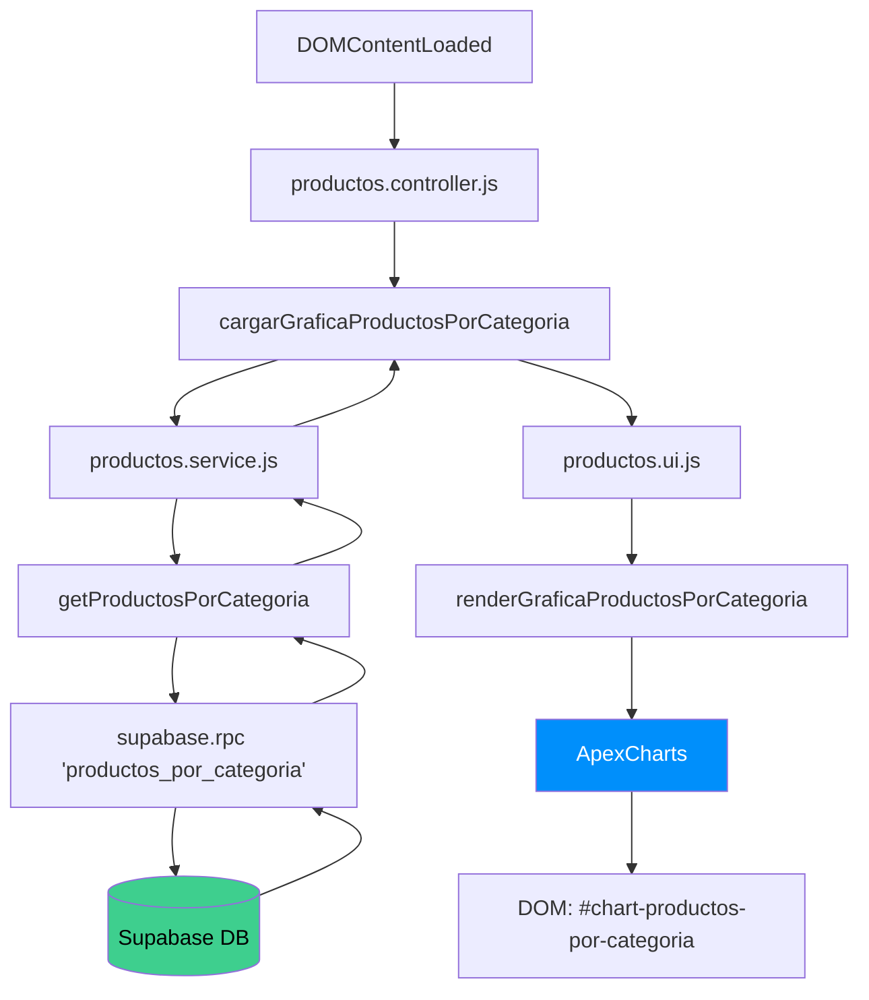
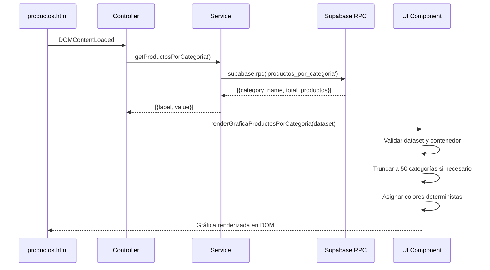

# Design Document: Products by Category Chart

## Overview

Este diseño describe la implementación de una gráfica de barras verticales que muestra la cantidad de productos agrupados por categoría en el módulo de productos del admin-dashboard de ADDBOX PRO. La solución sigue el patrón arquitectónico existente del proyecto (Controller → Service → UI) y se integra con Supabase mediante una función RPC dedicada.

La gráfica se renderiza con ApexCharts (ya utilizado como estándar en el proyecto) y se invoca automáticamente al cargar la página de productos (`DOMContentLoaded`).

### Decisiones de Diseño Clave

1. **RPC en lugar de query directa**: Se usa una función RPC de Supabase para encapsular la lógica de agregación (LEFT JOIN + GROUP BY) en el servidor, reduciendo la transferencia de datos y aprovechando RLS a nivel de función.
2. **Normalización en el servicio**: El servicio transforma la respuesta de la RPC (`{category_name, total_productos}`) al formato genérico `{label, value}`, desacoplando la capa de datos de la presentación.
3. **Paleta de colores determinista**: Se usa un hash del nombre de categoría para asignar colores consistentes entre recargas, evitando confusión visual.
4. **Límite de 50 categorías**: Se establece un máximo para mantener la legibilidad de la gráfica.

## Architecture



### Flujo de Datos



## Components and Interfaces

### 1. Función RPC: `productos_por_categoria`

**Ubicación**: Supabase Database (función PostgreSQL)

```sql
CREATE OR REPLACE FUNCTION productos_por_categoria()
RETURNS TABLE(category_name VARCHAR, total_productos BIGINT)
LANGUAGE plpgsql
SECURITY DEFINER
AS $$
BEGIN
  RETURN QUERY
  SELECT
    COALESCE(c.nombre, 'Sin categoría') AS category_name,
    COUNT(p.id)::BIGINT AS total_productos
  FROM categorias c
  LEFT JOIN productos p ON p.categoria_id = c.id AND p.estado = 'activo'
  GROUP BY c.nombre
  ORDER BY category_name ASC;
END;
$$;
```

**Interfaz de salida**:
| Columna | Tipo | Descripción |
|---------|------|-------------|
| `category_name` | VARCHAR | Nombre de la categoría (nunca null) |
| `total_productos` | BIGINT | Conteo de productos activos (>= 0) |

### 2. Servicio: `getProductosPorCategoria()`

**Ubicación**: `modules/productos/productos.service.js`

```javascript
/**
 * Obtiene productos agrupados por categoría desde la RPC.
 * @returns {Promise<Array<{label: string, value: number}>>}
 * @throws {Error} Si la RPC retorna un error
 */
export async function getProductosPorCategoria() { ... }
```

**Contrato**:
- **Input**: Ninguno
- **Output**: `Array<{label: string, value: number}>` — nunca contiene null en label ni value
- **Errores**: Lanza excepción con el mensaje exacto de Supabase

### 3. Controlador: `cargarGraficaProductosPorCategoria()`

**Ubicación**: `modules/productos/productos.controller.js`

```javascript
/**
 * Orquesta la carga de datos y renderización de la gráfica.
 * Se invoca en DOMContentLoaded.
 */
async function cargarGraficaProductosPorCategoria() { ... }
```

**Responsabilidades**:
- Invocar `getProductosPorCategoria()` del servicio
- Pasar el dataset a `renderGraficaProductosPorCategoria()`
- Capturar errores de ambas capas y mostrar toast de error
- No invocar render si el servicio falla

### 4. UI: `renderGraficaProductosPorCategoria(dataset)`

**Ubicación**: `modules/productos/productos.ui.js`

```javascript
/**
 * Renderiza gráfica de barras verticales con ApexCharts.
 * @param {Array<{label: string, value: number}>|null|undefined} dataset
 */
export function renderGraficaProductosPorCategoria(dataset) { ... }
```

**Comportamiento**:
- Si el contenedor no existe → no hacer nada, no lanzar error
- Si dataset es vacío/null/undefined → mostrar mensaje "No hay datos disponibles"
- Si dataset tiene > 50 categorías → tomar las primeras 50 alfabéticamente
- Truncar labels > 20 caracteres con "…"
- Asignar colores deterministas basados en hash del nombre de categoría
- Configurar animación de entrada de 800ms

### 5. Contenedor HTML

**Ubicación**: `modules/productos/productos.html`

```html
<!-- Después de la sección KPIs, antes de acciones rápidas -->
<section class="chart-section" style="margin-bottom:24px;">
  <h3 style="font-size:14px;color:#9ca3af;margin-bottom:12px;">
    Productos por Categoría
  </h3>
  <div id="chart-productos-por-categoria" style="min-height:300px;"></div>
</section>
```

## Data Models

### Modelo de datos de la RPC (entrada/salida)

```
Tablas involucradas:
┌─────────────────┐       ┌─────────────────┐
│   categorias    │       │    productos     │
├─────────────────┤       ├─────────────────┤
│ id (UUID, PK)   │◄──────│ categoria_id(FK)│
│ nombre (VARCHAR) │       │ id (UUID, PK)   │
│ ...             │       │ estado (VARCHAR) │
└─────────────────┘       │ ...             │
                          └─────────────────┘
```

### Dataset normalizado (interfaz entre Service y UI)

```typescript
// Tipo conceptual del dataset
interface DatasetItem {
  label: string;  // Nombre de categoría (nunca null, default: "Sin categoría")
  value: number;  // Conteo de productos activos (entero >= 0, default: 0)
}

type Dataset = DatasetItem[];
```

### Configuración de ApexCharts

```javascript
const chartOptions = {
  chart: {
    type: "bar",
    height: 300,
    animations: {
      enabled: true,
      easing: "easeinout",
      speed: 800,
    },
  },
  series: [{ name: "Productos", data: values }],
  xaxis: {
    categories: labels, // Truncados a 20 chars
  },
  yaxis: {
    labels: { formatter: (val) => Math.floor(val) },
  },
  colors: coloresAsignados, // Paleta determinista
  plotOptions: {
    bar: { distributed: true, columnWidth: "60%" },
  },
};
```

## Correctness Properties

*A property is a characteristic or behavior that should hold true across all valid executions of a system—essentially, a formal statement about what the system should do. Properties serve as the bridge between human-readable specifications and machine-verifiable correctness guarantees.*

### Property 1: Result ordering

*For any* result returned by the RPC function `productos_por_categoria`, the `category_name` values SHALL be in ascending alphabetical order.

**Validates: Requirements 1.1**

### Property 2: Category completeness (LEFT JOIN)

*For any* set of categories in the database, the RPC result SHALL contain exactly one row per category, and categories with no active products SHALL have `total_productos` equal to 0.

**Validates: Requirements 1.2, 6.2**

### Property 3: Active-only sum conservation

*For any* state of the database, the sum of all `total_productos` values in the RPC result SHALL equal the total count of rows in the `productos` table where `estado = 'activo'`.

**Validates: Requirements 1.5, 6.3**

### Property 4: Data transformation with null safety

*For any* array of RPC results (including entries with null/undefined `category_name` or `total_productos`), the service function `getProductosPorCategoria()` SHALL produce an array of `{label, value}` objects where `label` is always a non-empty string (defaulting to "Sin categoría" for null/undefined) and `value` is always a non-negative integer (defaulting to 0 for null/undefined).

**Validates: Requirements 2.2, 2.5**

### Property 5: Error message propagation

*For any* error returned by the Supabase RPC call, the service function SHALL throw an exception containing the exact error message from Supabase without modification.

**Validates: Requirements 2.3**

### Property 6: Controller error handling

*For any* error thrown during chart loading (whether from the service layer or the render function), the controller SHALL display an error toast with type "error" and SHALL NOT leave the system in an inconsistent state (i.e., if service fails, render is not called).

**Validates: Requirements 3.2, 3.4**

### Property 7: Label truncation

*For any* category name with length greater than 20 characters, the UI component SHALL truncate it to 20 characters followed by "…" in the chart's X-axis labels.

**Validates: Requirements 4.2**

### Property 8: Deterministic color mapping

*For any* category name, the color assignment function SHALL always return the same color for the same name across multiple invocations, ensuring visual consistency between page reloads.

**Validates: Requirements 4.3**

### Property 9: Category limit enforcement

*For any* dataset containing more than 50 categories, the UI component SHALL render exactly the first 50 categories when sorted alphabetically by name, discarding the rest.

**Validates: Requirements 4.6**

### Property 10: Result integrity

*For any* result returned by the RPC function, each row SHALL have a unique `category_name` (no duplicates) and `total_productos` SHALL be a non-negative integer (never null, never negative).

**Validates: Requirements 6.1, 6.2, 6.4**

## Error Handling

| Capa | Error | Acción |
|------|-------|--------|
| RPC (Supabase) | Error de conexión o permisos | Service lanza excepción con mensaje original |
| Service | RPC retorna `error` | Lanza `throw error` con `error.message` |
| Service | Datos con null | Aplica defaults ("Sin categoría", 0) — no lanza error |
| Controller | Service lanza error | `showToast("Error al cargar datos de la gráfica", "error")` — no invoca render |
| Controller | Render lanza error | `showToast("Error al renderizar la gráfica", "error")` |
| UI | Contenedor no existe en DOM | Retorna silenciosamente sin error |
| UI | Dataset vacío/null/undefined | Muestra mensaje "No hay datos disponibles para la gráfica" |
| UI | ApexCharts no disponible (CDN falla) | Muestra mensaje "La gráfica no pudo ser cargada" en el contenedor |

### Estrategia de Degradación Graceful

1. Si la RPC falla → el resto de la página de productos funciona normalmente, solo la gráfica muestra error via toast.
2. Si ApexCharts no carga → se muestra un mensaje estático en el contenedor, sin afectar otras funcionalidades.
3. Si el contenedor HTML no existe → no se ejecuta ninguna lógica de gráfica, evitando errores en consola.

## Testing Strategy

### Enfoque Dual: Unit Tests + Property-Based Tests

**Librería PBT**: [fast-check](https://github.com/dubzzz/fast-check) (estándar para JavaScript/TypeScript)

**Configuración**: Mínimo 100 iteraciones por property test.

### Unit Tests (Example-Based)

| Test | Capa | Descripción |
|------|------|-------------|
| Service retorna array vacío cuando RPC retorna vacío | Service | Verifica edge case de array vacío |
| Controller invoca render con dataset del service | Controller | Verifica orquestación correcta |
| Controller se invoca en DOMContentLoaded | Controller | Verifica inicialización |
| UI muestra "No hay datos" con dataset vacío | UI | Verifica estado vacío |
| UI no lanza error sin contenedor en DOM | UI | Verifica degradación graceful |
| UI muestra mensaje si ApexCharts no está disponible | UI | Verifica fallback CDN |
| HTML contiene div con id correcto y min-height 300px | HTML | Verifica estructura |
| ApexCharts CDN se carga antes del controller script | HTML | Verifica orden de scripts |

### Property-Based Tests

Cada test referencia su propiedad del diseño:

| Tag | Propiedad | Generador |
|-----|-----------|-----------|
| Feature: products-by-category-chart, Property 1: Result ordering | Ordenamiento alfabético | Arreglos aleatorios de `{category_name, total_productos}` |
| Feature: products-by-category-chart, Property 4: Data transformation with null safety | Transformación + null safety | Objetos con campos null/undefined/válidos |
| Feature: products-by-category-chart, Property 5: Error message propagation | Propagación de errores | Strings aleatorios como mensajes de error |
| Feature: products-by-category-chart, Property 6: Controller error handling | Manejo de errores en controller | Errores aleatorios en service y render |
| Feature: products-by-category-chart, Property 7: Label truncation | Truncamiento de labels | Strings de longitud variable (1-200 chars) |
| Feature: products-by-category-chart, Property 8: Deterministic color mapping | Colores deterministas | Strings aleatorios como nombres de categoría |
| Feature: products-by-category-chart, Property 9: Category limit enforcement | Límite de 50 categorías | Arreglos de 51-200 objetos `{label, value}` |
| Feature: products-by-category-chart, Property 10: Result integrity | Integridad de resultado | Arreglos con valores variados |

### Integration Tests

| Test | Descripción |
|------|-------------|
| RPC con usuario autorizado (admin) | Verifica que la RPC retorna datos correctos |
| RPC con usuario no autorizado | Verifica que RLS deniega acceso |
| Flujo completo: carga de página → gráfica visible | Verifica integración end-to-end |

### Notas sobre Properties 2, 3 (RPC)

Las propiedades 2 (completeness) y 3 (sum conservation) se validan mejor como integration tests contra la base de datos real con datos de prueba controlados, ya que requieren estado de base de datos específico. Se incluyen como properties conceptuales pero su implementación será via integration tests con 2-3 escenarios representativos.
