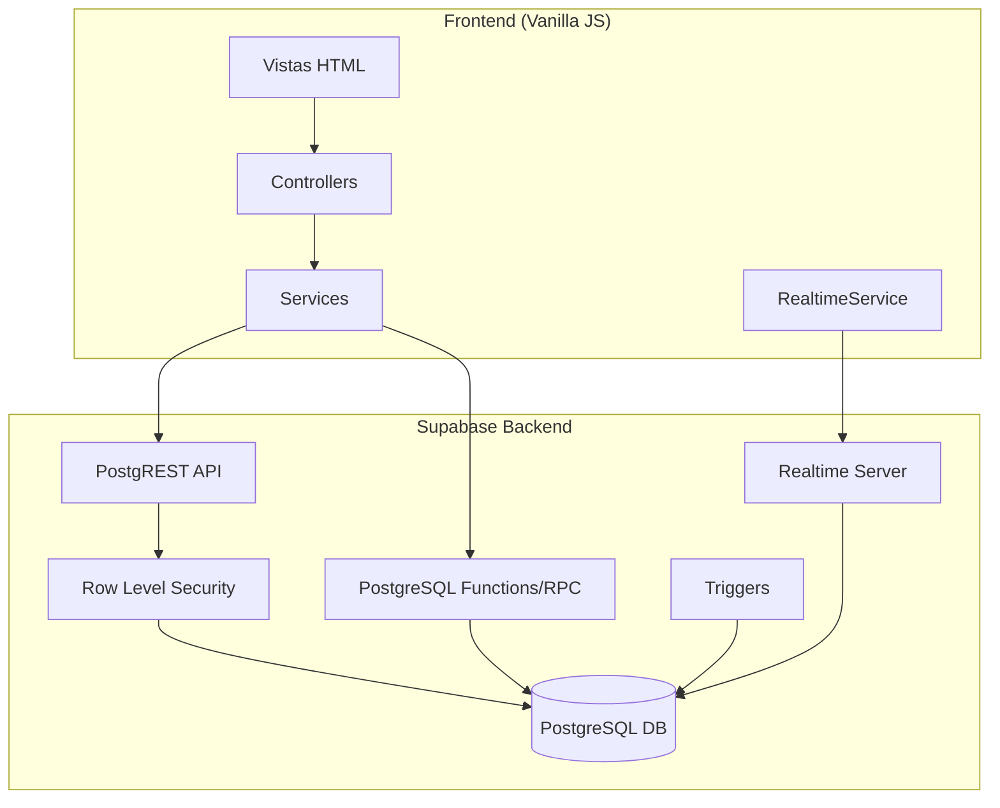
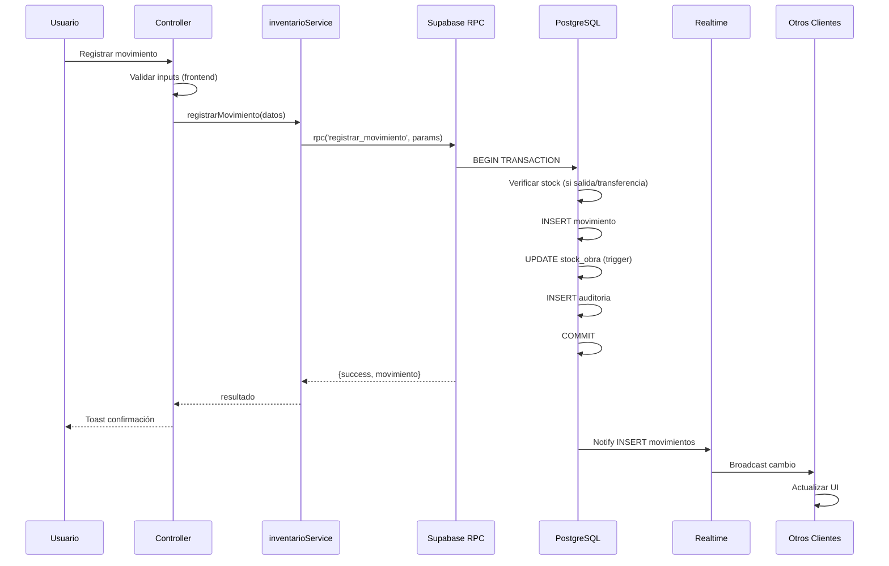
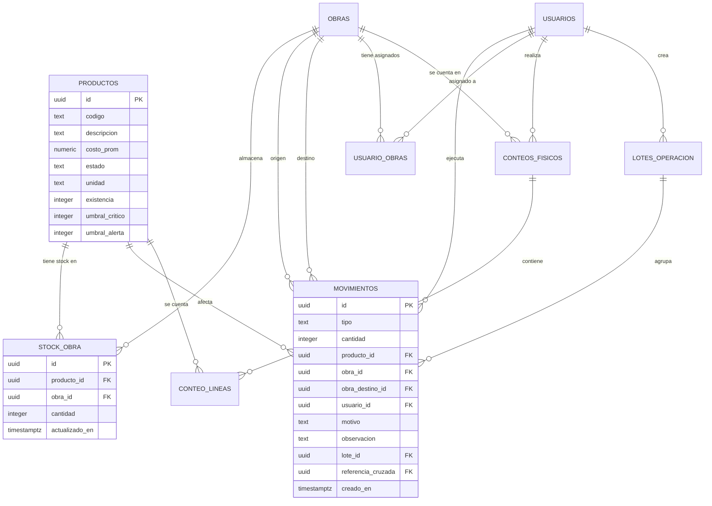

# Design Document: Real Product Inventory

## Overview

Sistema de inventario en tiempo real para ADDBOX que reemplaza la gestión manual de existencias con un flujo auditable, multi-almacén y en tiempo real. El sistema se integra con la arquitectura existente (vanilla HTML/JS + Supabase v1) y extiende los módulos actuales de inventario y movimientos con capacidades de stock por obra, reconciliación física, operaciones por lote, alertas de umbral y suscripciones en tiempo real.

### Decisiones de Diseño Clave

1. **Stock calculado vs. materializado**: Se usa una tabla `stock_obra` materializada (no calculada on-the-fly) para rendimiento en consultas. Se mantiene sincronizada mediante triggers de PostgreSQL en la tabla `movimientos`.
2. **Atomicidad via funciones RPC**: Las operaciones críticas (salidas, transferencias, lotes) se ejecutan como funciones PostgreSQL (`plpgsql`) para garantizar atomicidad y validación de stock en el servidor.
3. **Supabase Realtime v1**: Se usa `supabase.from('movimientos').on('INSERT', callback).subscribe()` para actualizaciones en tiempo real, compatible con la versión 1 del cliente ya instalada.
4. **Patrón MVC existente**: Se mantiene el patrón `*.service.js` / `*.controller.js` / `*.ui.js` del proyecto.
5. **RLS (Row Level Security)**: Se implementan políticas RLS en PostgreSQL para enforcement de permisos a nivel de servidor.

## Architecture

### Diagrama de Arquitectura General



### Diagrama de Flujo de Datos — Registro de Movimiento



## Components and Interfaces

### Estructura de Módulos (Frontend)

```
admin-dashboard/
├── modules/
│   └── inventario/
│       ├── inventario.html              (Vista principal multi-almacén)
│       ├── inventario.controller.js     (Orquestador de la vista)
│       ├── inventario.service.js        (Capa de datos - stock y movimientos)
│       ├── inventario.ui.js             (Renderizado de tablas, KPIs, alertas)
│       ├── movimientos-form.html        (Modal registro de movimientos)
│       ├── movimientos-form.controller.js
│       ├── reconciliacion.html          (Vista de conteo físico)
│       ├── reconciliacion.controller.js
│       ├── reconciliacion.service.js
│       ├── lote.html                    (Vista operaciones por lote)
│       ├── lote.controller.js
│       ├── lote.service.js
│       ├── reportes-inventario.html     (Vista de reportes)
│       ├── reportes-inventario.controller.js
│       └── reportes-inventario.service.js
├── services/
│   ├── supabase-client.js              (Existente)
│   ├── realtimeService.js              (NUEVO - gestión de suscripciones)
│   ├── stockAlertService.js            (NUEVO - lógica de alertas)
│   ├── csvService.js                   (NUEVO - parsing/export CSV)
│   ├── auditService.js                 (Existente - extendido)
│   ├── sessionService.js              (Existente)
│   ├── role-guard.js                  (Existente)
│   ├── toastService.js                (Existente)
│   └── error-handler.js              (Existente)
```

### Interfaces de Servicios

#### `inventario.service.js`

```javascript
// Consultas de stock
export async function obtenerStockPorObra(obraId)
// Returns: [{ producto_id, codigo, descripcion, unidad, cantidad, costo_prom, estado_alerta }]

export async function obtenerStockConsolidado()
// Returns: [{ producto_id, codigo, descripcion, stock_total, num_obras, valor_total }]

export async function obtenerStockProductoObra(productoId, obraId)
// Returns: { cantidad: number }

// Registro de movimientos (via RPC para atomicidad)
export async function registrarEntrada({ productoId, obraId, cantidad, observacion })
// Returns: { success: boolean, movimiento: object, error?: string }

export async function registrarSalida({ productoId, obraId, cantidad, observacion })
// Returns: { success: boolean, movimiento: object, error?: string }

export async function registrarTransferencia({ productoId, obraOrigenId, obraDestinoId, cantidad, observacion })
// Returns: { success: boolean, movimientos: [salida, entrada], error?: string }

export async function registrarAjuste({ productoId, obraId, cantidad, motivo })
// Returns: { success: boolean, movimiento: object, error?: string }

// Historial
export async function obtenerMovimientosPorObra(obraId, { limit, offset })
// Returns: { data: Movimiento[], total: number }
```

#### `realtimeService.js`

```javascript
export class RealtimeService {
  constructor(supabaseClient)

  // Suscribirse a cambios de movimientos por obra
  subscribe(obraId, onInsert)
  // Returns: void (calls onInsert(newMovimiento) on each INSERT)

  // Cancelar suscripción activa
  unsubscribe()
  // Returns: void

  // Estado de conexión
  getStatus()
  // Returns: 'connected' | 'reconnecting' | 'disconnected'

  // Reintento manual
  retry()
  // Returns: void
}
```

#### `stockAlertService.js`

```javascript
// Clasificar estado de alerta de un producto
export function clasificarAlerta(cantidad, umbralCritico, umbralAlerta)
// Returns: 'critico' | 'alerta' | 'normal'

// Obtener umbrales de un producto (personalizados o default)
export async function obtenerUmbrales(productoId)
// Returns: { umbral_critico: number, umbral_alerta: number }

// Configurar umbrales personalizados
export async function configurarUmbrales(productoId, umbralCritico, umbralAlerta)
// Returns: { success: boolean, error?: string }

// Obtener productos en estado crítico
export async function obtenerProductosCriticos(obraId?)
// Returns: [{ producto_id, descripcion, obra, cantidad, umbral_critico }]
```

#### `reconciliacion.service.js`

```javascript
// Iniciar conteo físico
export async function iniciarConteoFisico(obraId)
// Returns: { conteo_id, productos: [{ producto_id, codigo, descripcion, stock_sistema }] }

// Registrar cantidad física de un producto
export async function registrarCantidadFisica(conteoId, productoId, cantidadFisica)
// Returns: { success: boolean, error?: string }

// Finalizar conteo y calcular diferencias
export async function finalizarConteo(conteoId)
// Returns: { diferencias: [{ producto_id, stock_sistema, stock_fisico, diferencia }] }

// Aprobar reconciliación (genera ajustes)
export async function aprobarReconciliacion(conteoId)
// Returns: { success: boolean, ajustes_generados: number }

// Rechazar reconciliación
export async function rechazarReconciliacion(conteoId)
// Returns: { success: boolean }
```

#### `lote.service.js`

```javascript
// Validar lote completo
export function validarLote(lineas)
// Returns: { valido: boolean, errores: [{ linea: number, motivo: string }] }

// Procesar lote (via RPC atómico)
export async function procesarLote(lineas)
// Returns: { success: boolean, movimientos_creados: number, lote_id: string, error?: string }

// Parsear CSV a líneas de lote
export function parsearCSV(contenidoCSV)
// Returns: { lineas: [{ codigo_producto, cantidad, tipo, obra }], errores: [{ fila, motivo }] }
```

#### `csvService.js`

```javascript
// Parsear contenido CSV
export function parsearCSV(texto, columnasEsperadas)
// Returns: { filas: object[], errores: [{ fila: number, motivo: string }] }

// Generar CSV desde datos
export function generarCSV(datos, columnas, metadata)
// Returns: string (contenido CSV con BOM para Excel)

// Descargar CSV como archivo
export function descargarCSV(contenido, nombreArchivo)
// Returns: void (trigger download)
```

## Data Models

### Esquema de Base de Datos (PostgreSQL/Supabase)

#### Tabla `obras` (existente, extendida)

```sql
CREATE TABLE obras (
  id UUID PRIMARY KEY DEFAULT gen_random_uuid(),
  nombre TEXT NOT NULL,
  direccion TEXT,
  estado TEXT DEFAULT 'activa' CHECK (estado IN ('activa', 'inactiva')),
  creado_en TIMESTAMPTZ DEFAULT now()
);
```

#### Tabla `productos` (existente, extendida)

```sql
-- Campos existentes: id, codigo, descripcion, costo_prom, estado, unidad, existencia
-- Nuevos campos:
ALTER TABLE productos ADD COLUMN umbral_critico INTEGER DEFAULT 5;
ALTER TABLE productos ADD COLUMN umbral_alerta INTEGER DEFAULT 9;
ALTER TABLE productos ADD CONSTRAINT chk_umbrales
  CHECK (umbral_critico > 0 AND umbral_alerta > umbral_critico);
```

#### Tabla `stock_obra` (NUEVA — stock materializado por producto-obra)

```sql
CREATE TABLE stock_obra (
  id UUID PRIMARY KEY DEFAULT gen_random_uuid(),
  producto_id UUID NOT NULL REFERENCES productos(id),
  obra_id UUID NOT NULL REFERENCES obras(id),
  cantidad INTEGER NOT NULL DEFAULT 0 CHECK (cantidad >= 0),
  actualizado_en TIMESTAMPTZ DEFAULT now(),
  UNIQUE(producto_id, obra_id)
);

CREATE INDEX idx_stock_obra_producto ON stock_obra(producto_id);
CREATE INDEX idx_stock_obra_obra ON stock_obra(obra_id);
CREATE INDEX idx_stock_obra_cantidad ON stock_obra(cantidad);
```

#### Tabla `movimientos` (existente, extendida)

```sql
-- Campos existentes: id, cantidad, tipo, creado_en, producto_id, obra_id
-- Nuevos campos y constraints:
ALTER TABLE movimientos ADD COLUMN usuario_id UUID REFERENCES auth.users(id);
ALTER TABLE movimientos ADD COLUMN obra_destino_id UUID REFERENCES obras(id);
ALTER TABLE movimientos ADD COLUMN motivo TEXT;
ALTER TABLE movimientos ADD COLUMN lote_id UUID;
ALTER TABLE movimientos ADD COLUMN referencia_cruzada UUID REFERENCES movimientos(id);
ALTER TABLE movimientos ADD COLUMN observacion TEXT;

ALTER TABLE movimientos ADD CONSTRAINT chk_tipo
  CHECK (tipo IN ('entrada', 'salida', 'ajuste', 'transferencia_salida', 'transferencia_entrada'));
ALTER TABLE movimientos ADD CONSTRAINT chk_cantidad_no_cero
  CHECK (cantidad != 0);
ALTER TABLE movimientos ADD CONSTRAINT chk_motivo_ajuste
  CHECK (tipo != 'ajuste' OR (motivo IS NOT NULL AND length(motivo) >= 10));
```

#### Tabla `conteos_fisicos` (NUEVA)

```sql
CREATE TABLE conteos_fisicos (
  id UUID PRIMARY KEY DEFAULT gen_random_uuid(),
  obra_id UUID NOT NULL REFERENCES obras(id),
  usuario_id UUID NOT NULL REFERENCES auth.users(id),
  estado TEXT NOT NULL DEFAULT 'en_progreso'
    CHECK (estado IN ('en_progreso', 'completado', 'reconciliado')),
  creado_en TIMESTAMPTZ DEFAULT now(),
  completado_en TIMESTAMPTZ,
  reconciliado_en TIMESTAMPTZ
);

CREATE INDEX idx_conteos_obra ON conteos_fisicos(obra_id);
CREATE INDEX idx_conteos_estado ON conteos_fisicos(estado);
```

#### Tabla `conteo_lineas` (NUEVA — detalle de cada producto contado)

```sql
CREATE TABLE conteo_lineas (
  id UUID PRIMARY KEY DEFAULT gen_random_uuid(),
  conteo_id UUID NOT NULL REFERENCES conteos_fisicos(id) ON DELETE CASCADE,
  producto_id UUID NOT NULL REFERENCES productos(id),
  stock_sistema INTEGER NOT NULL,
  stock_fisico INTEGER,
  diferencia INTEGER GENERATED ALWAYS AS (stock_fisico - stock_sistema) STORED,
  UNIQUE(conteo_id, producto_id)
);
```

#### Tabla `lotes_operacion` (NUEVA)

```sql
CREATE TABLE lotes_operacion (
  id UUID PRIMARY KEY DEFAULT gen_random_uuid(),
  usuario_id UUID NOT NULL REFERENCES auth.users(id),
  total_lineas INTEGER NOT NULL CHECK (total_lineas BETWEEN 1 AND 500),
  estado TEXT NOT NULL DEFAULT 'procesado'
    CHECK (estado IN ('procesado', 'fallido')),
  creado_en TIMESTAMPTZ DEFAULT now()
);
```

#### Tabla `usuario_obras` (NUEVA — asignación almacenista-obra)

```sql
CREATE TABLE usuario_obras (
  id UUID PRIMARY KEY DEFAULT gen_random_uuid(),
  usuario_id UUID NOT NULL REFERENCES auth.users(id),
  obra_id UUID NOT NULL REFERENCES obras(id),
  asignado_en TIMESTAMPTZ DEFAULT now(),
  UNIQUE(usuario_id, obra_id)
);
```

### Funciones PostgreSQL (RPC)

#### `registrar_movimiento` — Operación atómica de stock

```sql
CREATE OR REPLACE FUNCTION registrar_movimiento(
  p_tipo TEXT,
  p_producto_id UUID,
  p_obra_id UUID,
  p_cantidad INTEGER,
  p_usuario_id UUID,
  p_motivo TEXT DEFAULT NULL,
  p_observacion TEXT DEFAULT NULL,
  p_obra_destino_id UUID DEFAULT NULL,
  p_lote_id UUID DEFAULT NULL
) RETURNS JSONB AS $$
DECLARE
  v_stock_actual INTEGER;
  v_mov_id UUID;
  v_mov_entrada_id UUID;
BEGIN
  -- Validar cantidad
  IF p_tipo IN ('entrada', 'salida') AND (p_cantidad < 1 OR p_cantidad > 999999) THEN
    RETURN jsonb_build_object('success', false, 'error', 'Cantidad fuera de rango (1-999999)');
  END IF;

  -- Para salidas y transferencias: verificar stock
  IF p_tipo IN ('salida', 'transferencia_salida') THEN
    SELECT cantidad INTO v_stock_actual
    FROM stock_obra
    WHERE producto_id = p_producto_id AND obra_id = p_obra_id
    FOR UPDATE; -- Lock row for concurrency

    IF v_stock_actual IS NULL OR v_stock_actual < p_cantidad THEN
      RETURN jsonb_build_object('success', false, 'error',
        format('Stock insuficiente. Disponible: %s', COALESCE(v_stock_actual, 0)));
    END IF;
  END IF;

  -- Insertar movimiento
  INSERT INTO movimientos (tipo, producto_id, obra_id, cantidad, usuario_id, motivo, observacion, lote_id)
  VALUES (p_tipo, p_producto_id, p_obra_id, p_cantidad, p_usuario_id, p_motivo, p_observacion, p_lote_id)
  RETURNING id INTO v_mov_id;

  -- Actualizar stock_obra
  IF p_tipo IN ('entrada', 'transferencia_entrada') THEN
    INSERT INTO stock_obra (producto_id, obra_id, cantidad)
    VALUES (p_producto_id, p_obra_id, p_cantidad)
    ON CONFLICT (producto_id, obra_id)
    DO UPDATE SET cantidad = stock_obra.cantidad + p_cantidad, actualizado_en = now();
  ELSIF p_tipo IN ('salida', 'transferencia_salida') THEN
    UPDATE stock_obra SET cantidad = cantidad - p_cantidad, actualizado_en = now()
    WHERE producto_id = p_producto_id AND obra_id = p_obra_id;
  ELSIF p_tipo = 'ajuste' THEN
    INSERT INTO stock_obra (producto_id, obra_id, cantidad)
    VALUES (p_producto_id, p_obra_id, GREATEST(0, p_cantidad))
    ON CONFLICT (producto_id, obra_id)
    DO UPDATE SET cantidad = GREATEST(0, stock_obra.cantidad + p_cantidad), actualizado_en = now();
  END IF;

  -- Para transferencias: crear movimiento de entrada en destino
  IF p_tipo = 'transferencia_salida' AND p_obra_destino_id IS NOT NULL THEN
    INSERT INTO movimientos (tipo, producto_id, obra_id, cantidad, usuario_id, observacion, lote_id, referencia_cruzada)
    VALUES ('transferencia_entrada', p_producto_id, p_obra_destino_id, p_cantidad, p_usuario_id, p_observacion, p_lote_id, v_mov_id)
    RETURNING id INTO v_mov_entrada_id;

    -- Actualizar referencia cruzada en el movimiento de salida
    UPDATE movimientos SET referencia_cruzada = v_mov_entrada_id WHERE id = v_mov_id;

    -- Actualizar stock en destino
    INSERT INTO stock_obra (producto_id, obra_id, cantidad)
    VALUES (p_producto_id, p_obra_destino_id, p_cantidad)
    ON CONFLICT (producto_id, obra_id)
    DO UPDATE SET cantidad = stock_obra.cantidad + p_cantidad, actualizado_en = now();
  END IF;

  RETURN jsonb_build_object('success', true, 'movimiento_id', v_mov_id);
END;
$$ LANGUAGE plpgsql SECURITY DEFINER;
```

#### `procesar_lote` — Operación atómica de lote

```sql
CREATE OR REPLACE FUNCTION procesar_lote(
  p_lineas JSONB,  -- Array de {producto_id, obra_id, cantidad, tipo, motivo?}
  p_usuario_id UUID
) RETURNS JSONB AS $$
DECLARE
  v_linea JSONB;
  v_lote_id UUID;
  v_resultado JSONB;
  v_total INTEGER;
BEGIN
  v_total := jsonb_array_length(p_lineas);
  IF v_total < 1 OR v_total > 500 THEN
    RETURN jsonb_build_object('success', false, 'error', 'El lote debe tener entre 1 y 500 líneas');
  END IF;

  -- Crear registro de lote
  INSERT INTO lotes_operacion (usuario_id, total_lineas)
  VALUES (p_usuario_id, v_total)
  RETURNING id INTO v_lote_id;

  -- Procesar cada línea
  FOR v_linea IN SELECT * FROM jsonb_array_elements(p_lineas)
  LOOP
    v_resultado := registrar_movimiento(
      v_linea->>'tipo',
      (v_linea->>'producto_id')::UUID,
      (v_linea->>'obra_id')::UUID,
      (v_linea->>'cantidad')::INTEGER,
      p_usuario_id,
      v_linea->>'motivo',
      v_linea->>'observacion',
      CASE WHEN v_linea->>'obra_destino_id' IS NOT NULL
        THEN (v_linea->>'obra_destino_id')::UUID ELSE NULL END,
      v_lote_id
    );

    IF NOT (v_resultado->>'success')::BOOLEAN THEN
      RAISE EXCEPTION 'Error en línea del lote: %', v_resultado->>'error';
    END IF;
  END LOOP;

  RETURN jsonb_build_object('success', true, 'lote_id', v_lote_id, 'movimientos_creados', v_total);
EXCEPTION
  WHEN OTHERS THEN
    -- Rollback automático por la excepción
    UPDATE lotes_operacion SET estado = 'fallido' WHERE id = v_lote_id;
    RETURN jsonb_build_object('success', false, 'error', SQLERRM);
END;
$$ LANGUAGE plpgsql SECURITY DEFINER;
```

### Row Level Security (RLS) Policies

```sql
-- Habilitar RLS en tablas nuevas
ALTER TABLE stock_obra ENABLE ROW LEVEL SECURITY;
ALTER TABLE movimientos ENABLE ROW LEVEL SECURITY;
ALTER TABLE conteos_fisicos ENABLE ROW LEVEL SECURITY;
ALTER TABLE conteo_lineas ENABLE ROW LEVEL SECURITY;

-- stock_obra: lectura según rol
CREATE POLICY "stock_obra_select_admin" ON stock_obra FOR SELECT
  USING (
    EXISTS (SELECT 1 FROM usuarios WHERE id = auth.uid() AND rol IN ('admin', 'jefe', 'supervisor'))
  );

CREATE POLICY "stock_obra_select_almacenista" ON stock_obra FOR SELECT
  USING (
    EXISTS (
      SELECT 1 FROM usuario_obras uo
      JOIN usuarios u ON u.id = auth.uid()
      WHERE uo.usuario_id = auth.uid()
        AND uo.obra_id = stock_obra.obra_id
        AND u.rol = 'almacenista'
    )
  );
```

```sql
-- movimientos: solo INSERT via RPC, lectura según rol
CREATE POLICY "movimientos_select_admin" ON movimientos FOR SELECT
  USING (
    EXISTS (SELECT 1 FROM usuarios WHERE id = auth.uid() AND rol IN ('admin', 'jefe', 'supervisor'))
  );

CREATE POLICY "movimientos_select_almacenista" ON movimientos FOR SELECT
  USING (
    EXISTS (
      SELECT 1 FROM usuario_obras uo
      WHERE uo.usuario_id = auth.uid() AND uo.obra_id = movimientos.obra_id
    )
  );

-- auditoria: solo lectura para admin/jefe, sin UPDATE/DELETE
CREATE POLICY "auditoria_select" ON auditoria FOR SELECT
  USING (
    EXISTS (SELECT 1 FROM usuarios WHERE id = auth.uid() AND rol IN ('admin', 'jefe'))
  );

CREATE POLICY "auditoria_no_update" ON auditoria FOR UPDATE USING (false);
CREATE POLICY "auditoria_no_delete" ON auditoria FOR DELETE USING (false);

-- conteos_fisicos: supervisores y admin pueden crear/leer
CREATE POLICY "conteos_select" ON conteos_fisicos FOR SELECT
  USING (
    EXISTS (SELECT 1 FROM usuarios WHERE id = auth.uid() AND rol IN ('admin', 'jefe', 'supervisor'))
  );

CREATE POLICY "conteos_insert" ON conteos_fisicos FOR INSERT
  WITH CHECK (
    EXISTS (SELECT 1 FROM usuarios WHERE id = auth.uid() AND rol IN ('admin', 'jefe', 'supervisor'))
  );
```

### Diagrama Entidad-Relación



## Correctness Properties

*A property is a characteristic or behavior that should hold true across all valid executions of a system—essentially, a formal statement about what the system should do. Properties serve as the bridge between human-readable specifications and machine-verifiable correctness guarantees.*

### Property 1: Movement creation preserves required fields

*For any* valid movement registration (entry, exit, or adjustment) with valid type, quantity, product, obra, and user, the created movement record SHALL contain the correct type, quantity, product_id, obra_id, usuario_id, and a non-null timestamp.

**Validates: Requirements 1.1, 1.2, 1.4, 1.5**

### Property 2: Transfer creates exactly two linked movements

*For any* valid transfer of quantity Q from obra A to obra B for product P, the system SHALL create exactly two movements: one of type "transferencia_salida" in obra A and one of type "transferencia_entrada" in obra B, both with quantity Q and cross-referencing each other's IDs.

**Validates: Requirements 1.3**

### Property 3: Invalid quantity rejection

*For any* quantity value that is zero, negative, or greater than 999,999 for entries and exits, or exactly zero for adjustments, the system SHALL reject the movement registration and return an error message indicating the valid range.

**Validates: Requirements 1.6**

### Property 4: Stock sufficiency validation

*For any* exit or transfer attempt where the requested quantity exceeds the current stock of the product in the source obra, the system SHALL reject the operation and return an error message containing the current available stock.

**Validates: Requirements 1.7, 2.1, 2.3**

### Property 5: Stock calculation invariant

*For any* product P in obra O, the stock quantity SHALL equal the sum of all entry quantities and positive adjustment quantities minus the sum of all exit quantities and negative adjustment quantities for that product-obra combination.

**Validates: Requirements 1.8, 2.5**

### Property 6: Stock independence per obra

*For any* product P and two distinct obras A and B, registering a movement in obra A SHALL NOT modify the stock of product P in obra B.

**Validates: Requirements 3.1**

### Property 7: Obra filtering for almacenista role

*For any* user with role "almacenista" and a set of assigned obras, all stock queries and movement operations SHALL return or affect only data belonging to the assigned obras, and SHALL reject operations targeting unassigned obras.

**Validates: Requirements 3.7, 10.1**

### Property 8: Reconciliation difference calculation

*For any* completed physical count with recorded physical quantities, the calculated difference for each product SHALL equal (stock_fisico - stock_sistema), and the reconciliation SHALL list exactly those products where the difference is non-zero.

**Validates: Requirements 5.2, 5.3**

### Property 9: Reconciliation approval equalizes stock

*For any* approved reconciliation, after processing all generated adjustment movements, the stock_sistema for each reconciled product in that obra SHALL equal the stock_fisico value recorded during the physical count.

**Validates: Requirements 5.4**

### Property 10: Reconciliation rejection preserves stock

*For any* rejected reconciliation, the stock_sistema for all products in the affected obra SHALL remain unchanged from its value before the reconciliation was initiated.

**Validates: Requirements 5.5**

### Property 11: Batch all-or-nothing processing

*For any* batch operation containing N lines, if all lines pass validation the system SHALL create exactly N movements with a common lote_id, and if any single line fails validation the system SHALL create zero movements and report the specific errors per line.

**Validates: Requirements 6.2, 6.4**

### Property 12: Batch line error reporting

*For any* batch operation where K lines fail validation (K >= 1), the system SHALL return exactly K error entries, each identifying the line number and specific validation failure reason, while preserving all valid lines unchanged.

**Validates: Requirements 6.3**

### Property 13: CSV parsing round-trip

*For any* valid set of movement lines (with codigo_producto, cantidad, tipo, obra), generating a CSV and then parsing it back SHALL produce an equivalent set of movement lines.

**Validates: Requirements 6.5, 6.6**

### Property 14: Audit trail completeness

*For any* successfully created movement or reconciliation operation, a corresponding audit record SHALL exist containing: operation ID, movement type, product, quantity, obra, user, and timestamp with second precision.

**Validates: Requirements 7.1, 7.5**

### Property 15: Alert status classification

*For any* product with stock quantity Q, critical threshold TC, and alert threshold TA (where TC < TA), the alert status SHALL be "critico" if Q < TC, "alerta" if TC <= Q <= TA, and "normal" if Q > TA. Furthermore, when Q transitions from below TC to above TC, the critical notification SHALL be removed.

**Validates: Requirements 8.1, 8.2, 8.3, 8.7**

### Property 16: Threshold validation

*For any* pair of threshold values (umbral_critico, umbral_alerta), the system SHALL accept the configuration only if umbral_critico is an integer between 1 and 9999, umbral_alerta is an integer between 2 and 9999, and umbral_critico is strictly less than umbral_alerta. All other combinations SHALL be rejected.

**Validates: Requirements 8.4**

### Property 17: Inventory valuation calculation

*For any* set of products across obras, the valuation report SHALL calculate the total value as the sum of (stock_cantidad × costo_prom) for each product-obra combination, and the grand total SHALL equal the sum of all individual product-obra values.

**Validates: Requirements 9.3**

### Property 18: Rotation report ordering

*For any* set of products with movements in a given date range, the rotation report SHALL count the total number of movements per product and order results from highest to lowest movement count.

**Validates: Requirements 9.5**

### Property 19: Physical count input validation

*For any* physical count entry value that is non-numeric, negative, or greater than 999,999, the system SHALL reject the entry and display an error message indicating the valid range (0 to 999,999 integer).

**Validates: Requirements 5.8**

## Error Handling

### Estrategia de Errores por Capa

| Capa | Tipo de Error | Manejo |
|------|--------------|--------|
| Frontend (validación) | Campos vacíos, formato inválido | Toast warning + resaltar campo |
| Frontend (red) | Timeout, desconexión | Toast error + indicador de estado |
| RPC (negocio) | Stock insuficiente, rango inválido | Toast error + preservar formulario |
| RPC (concurrencia) | Conflicto de stock | Toast error + sugerir reintentar |
| RLS (permisos) | Acceso denegado | Toast error + redirigir si necesario |
| Realtime | Desconexión | Reconexión automática + indicador visual |

### Códigos de Error del Backend

```javascript
const ERRORES_INVENTARIO = {
  STOCK_INSUFICIENTE: 'Stock insuficiente. Disponible: {cantidad}',
  CANTIDAD_INVALIDA: 'Cantidad fuera de rango permitido (1-999,999)',
  CANTIDAD_CERO: 'La cantidad no puede ser cero',
  MOTIVO_CORTO: 'El motivo debe tener al menos 10 caracteres',
  OBRA_NO_ASIGNADA: 'No tiene acceso a esta obra',
  PRODUCTO_NO_EXISTE: 'El producto especificado no existe',
  OBRA_NO_EXISTE: 'La obra especificada no existe',
  CONTEO_EN_PROGRESO: 'Ya existe un conteo en progreso para esta obra',
  LOTE_EXCEDE_LIMITE: 'El lote excede el límite de 500 líneas',
  CSV_FORMATO_INVALIDO: 'Error en fila {fila}: {motivo}',
  UMBRAL_INVALIDO: 'El umbral crítico debe ser menor que el umbral de alerta',
  ACCESO_DENEGADO: 'No tiene permisos para realizar esta operación'
};
```

### Manejo de Reconexión Realtime

```javascript
// Intervalos de reconexión exponencial
const RETRY_INTERVALS = [1000, 2000, 4000, 8000, 16000]; // ms
const MAX_RETRIES = 5;

// Estados de conexión
const CONNECTION_STATES = {
  CONNECTED: 'connected',
  RECONNECTING: 'reconnecting',
  DISCONNECTED: 'disconnected'
};
```

### Validación Frontend (pre-envío)

Todas las validaciones se ejecutan en el frontend antes de enviar al backend para UX inmediata, pero el backend las re-valida para seguridad:

1. **Cantidad**: Número entero, > 0, <= 999,999 (entradas/salidas) o != 0 (ajustes)
2. **Motivo de ajuste**: Mínimo 10 caracteres
3. **Producto/Obra**: Seleccionados (no vacíos)
4. **Stock físico**: Entero >= 0, <= 999,999
5. **Umbrales**: Enteros, crítico < alerta, ambos en rango válido
6. **CSV**: Columnas requeridas presentes, <= 500 filas

## Testing Strategy

### Enfoque Dual: Unit Tests + Property-Based Tests

Este feature combina lógica de negocio pura (cálculos de stock, validaciones, clasificación de alertas, parsing CSV) con integración a Supabase. La estrategia usa:

- **Property-Based Tests (PBT)**: Para las funciones puras y lógica de negocio que tienen propiedades universales
- **Unit Tests**: Para escenarios específicos, edge cases, y comportamiento de UI
- **Integration Tests**: Para verificar RLS policies, funciones RPC, y Realtime

### Librería PBT

Se usará **fast-check** (JavaScript) por ser la librería PBT más madura para el ecosistema JS y compatible con cualquier test runner.

### Configuración PBT

- Mínimo **100 iteraciones** por property test
- Cada test referencia su property del documento de diseño
- Tag format: `Feature: real-product-inventory, Property {N}: {título}`

### Tests Property-Based (funciones puras)

| Property | Función bajo test | Generadores |
|----------|------------------|-------------|
| P1: Movement creation | `registrar_movimiento` (mock) | Tipos válidos, cantidades 1-999999, UUIDs |
| P3: Invalid quantity rejection | `validarCantidad()` | Cantidades inválidas: 0, negativos, >999999 |
| P4: Stock sufficiency | `registrar_movimiento` (mock) | Cantidades > stock actual |
| P5: Stock calculation | `calcularStock(movimientos[])` | Secuencias aleatorias de movimientos |
| P6: Stock independence | `registrar_movimiento` (mock) | Movimientos en obra A, verificar obra B |
| P8: Reconciliation diff | `calcularDiferencias(conteo)` | Stocks y conteos aleatorios |
| P11: Batch all-or-nothing | `validarLote(lineas[])` | Lotes con mix válido/inválido |
| P13: CSV round-trip | `generarCSV` / `parsearCSV` | Líneas aleatorias con caracteres especiales |
| P15: Alert classification | `clasificarAlerta(q, tc, ta)` | Cantidades y umbrales aleatorios |
| P16: Threshold validation | `validarUmbrales(tc, ta)` | Pares de enteros aleatorios |
| P17: Valuation calc | `calcularValorizacion(stock[])` | Productos con stock y costos aleatorios |
| P18: Rotation ordering | `calcularRotacion(movs[])` | Movimientos aleatorios por producto |
| P19: Physical count validation | `validarStockFisico(valor)` | Valores aleatorios (negativos, strings, >999999) |

### Unit Tests (ejemplos específicos)

- Transferencia crea 2 movimientos vinculados (P2 — ejemplo concreto)
- Reconciliación aprobada iguala stock (P9 — ejemplo con datos conocidos)
- Reconciliación rechazada no modifica stock (P10 — ejemplo)
- Almacenista solo ve obras asignadas (P7 — ejemplo con 2 obras)
- Audit trail registra reconciliación (P14 — ejemplo)
- Reconexión realtime con 5 intentos y intervalos correctos
- KPIs se actualizan sin recarga al recibir evento realtime
- Indicador visual de conexión cambia según estado
- Panel de productos críticos ordenado por menor stock

### Integration Tests

- RLS: almacenista no puede leer stock de obra no asignada
- RLS: auditoría no permite UPDATE ni DELETE
- RPC: `registrar_movimiento` rechaza stock negativo bajo concurrencia
- RPC: `procesar_lote` es atómico (rollback si falla una línea)
- Realtime: INSERT en movimientos llega al cliente en < 3s
- Export CSV: formato correcto con encabezado y fecha

### Estructura de Tests

```
admin-dashboard/
├── __tests__/
│   ├── properties/
│   │   ├── stock-calculation.property.test.js
│   │   ├── alert-classification.property.test.js
│   │   ├── quantity-validation.property.test.js
│   │   ├── csv-roundtrip.property.test.js
│   │   ├── batch-validation.property.test.js
│   │   ├── reconciliation.property.test.js
│   │   ├── threshold-validation.property.test.js
│   │   └── valuation-rotation.property.test.js
│   ├── unit/
│   │   ├── inventario.service.test.js
│   │   ├── realtimeService.test.js
│   │   ├── stockAlertService.test.js
│   │   └── reconciliacion.service.test.js
│   └── integration/
│       ├── rls-policies.test.js
│       ├── rpc-functions.test.js
│       └── realtime-subscription.test.js
```
