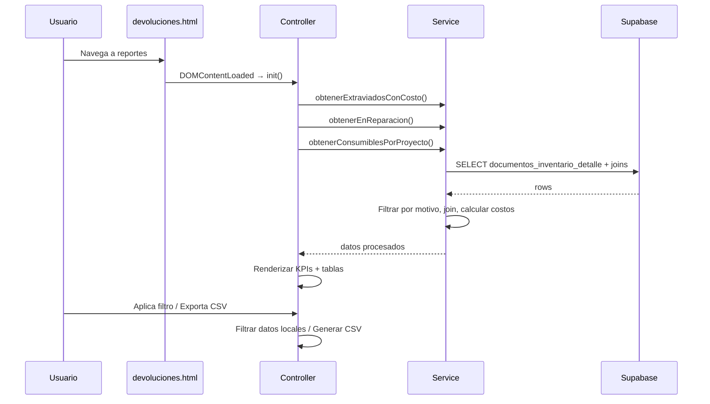

# Design Document: Reportes Motivo de Cierre

## Overview

Página de reportes que presenta datos consolidados sobre materiales cerrados por motivo (extraviado, en reparación, consumido). Incluye KPI cards de resumen, tres tablas detalladas con filtros, y exportación CSV por sección. Se integra con la arquitectura existente Service+Controller usando Vanilla JS y Supabase v1.

### Decisiones de diseño clave

1. **Service puro sin DOM**: El servicio solo consulta y transforma datos; no toca el DOM.
2. **Cálculos en cliente**: Los joins y agregaciones se hacen en JS tras obtener los datos de Supabase (consistente con el patrón existente en `devoluciones.service.js`).
3. **Filtros con semántica AND**: Todos los filtros activos se aplican simultáneamente (intersección).
4. **CSV generado en cliente**: Se construye el CSV en memoria y se descarga vía Blob URL.
5. **Reutilización de estilos**: Se usan las clases CSS existentes del dashboard (dark theme) sin CSS adicional.

## Architecture

```
modules/devoluciones/reportes-cierre.service.js  ← Lógica de datos
modules/reportes/reportes-cierre.controller.js   ← DOM + eventos
modules/reportes/devoluciones.html               ← Página HTML
```



## Components and Interfaces

### Service Layer — `reportes-cierre.service.js`

```javascript
import { supabase } from "../../services/supabase-client.js";

/**
 * Obtener herramientas extraviadas con costo de pérdida.
 * @returns {Promise<Array<HerramientaExtraviadaDTO>>}
 */
export async function obtenerExtraviadosConCosto() { }

/**
 * Obtener herramientas en reparación.
 * @returns {Promise<Array<HerramientaReparacionDTO>>}
 */
export async function obtenerEnReparacion() { }

/**
 * Obtener consumibles agrupados por proyecto con totales.
 * @returns {Promise<Array<ConsumibleProyectoDTO>>}
 */
export async function obtenerConsumiblesPorProyecto() { }

/**
 * Calcular KPIs de resumen a partir de los datos ya obtenidos.
 * @param {Array} extraviados
 * @param {Array} enReparacion
 * @returns {{totalExtraviados: number, totalEnReparacion: number, costoTotalPerdidas: number}}
 */
export function calcularKPIsReporte(extraviados, enReparacion) { }
```

### Controller Layer — `reportes-cierre.controller.js`

```javascript
import {
  obtenerExtraviadosConCosto,
  obtenerEnReparacion,
  obtenerConsumiblesPorProyecto,
  calcularKPIsReporte
} from "../devoluciones/reportes-cierre.service.js";

/**
 * Inicializa la página: carga datos, renderiza KPIs y tablas.
 */
async function init() { }

/**
 * Aplica filtros con semántica AND sobre la tabla de extraviados.
 * @param {Array} datos - Datos completos sin filtrar
 * @param {Object} filtros - { proyecto, fechaDesde, fechaHasta }
 * @returns {Array} Datos filtrados
 */
export function aplicarFiltrosExtraviados(datos, filtros) { }

/**
 * Genera un string CSV a partir de un array de objetos y headers.
 * @param {Array<Object>} filas - Datos a exportar
 * @param {Array<{key: string, label: string}>} columnas - Definición de columnas
 * @returns {string} Contenido CSV
 */
export function generarCSV(filas, columnas) { }

/**
 * Formatea un número como moneda con 2 decimales.
 * @param {number} valor
 * @returns {string} Ej: "$1,234.56"
 */
export function formatearMoneda(valor) { }
```

### HTML Page — `devoluciones.html`

```html
<!-- Estructura principal -->
<div class="main-layout">
  <div id="sidebar-container"></div>
  <main class="content">
    <div class="dashboard-center">
      <!-- KPI Cards -->
      <section class="kpi-section">
        <div class="kpi-card" id="kpi-total-extraviados">...</div>
        <div class="kpi-card" id="kpi-total-reparacion">...</div>
        <div class="kpi-card" id="kpi-costo-perdidas">...</div>
      </section>

      <!-- Tabla Extraviados (con filtros) -->
      <section class="report-section" id="seccion-extraviados">
        <div class="filtros-row">...</div>
        <table>...</table>
        <button class="btn-export-csv">Exportar CSV</button>
      </section>

      <!-- Tabla En Reparación -->
      <section class="report-section" id="seccion-reparacion">
        <table>...</table>
        <button class="btn-export-csv">Exportar CSV</button>
      </section>

      <!-- Tabla Consumibles por Proyecto -->
      <section class="report-section" id="seccion-consumibles">
        <table>...</table>
        <button class="btn-export-csv">Exportar CSV</button>
      </section>
    </div>
  </main>
</div>
```

## Data Models

### DTOs (Data Transfer Objects)

```javascript
/**
 * @typedef {Object} HerramientaExtraviadaDTO
 * @property {string} codigo
 * @property {string} descripcion
 * @property {number} cantidad_devuelta
 * @property {string} proyecto
 * @property {string} obra_nombre
 * @property {string} creado_en - ISO date string
 * @property {number} costo_prom
 * @property {number} costo_perdida - cantidad_devuelta * costo_prom
 */

/**
 * @typedef {Object} HerramientaReparacionDTO
 * @property {string} codigo
 * @property {string} descripcion
 * @property {number} cantidad_devuelta
 * @property {string} proyecto
 * @property {string} obra_nombre
 * @property {string} creado_en
 * @property {string} estado_especial - "en_reparacion"
 */

/**
 * @typedef {Object} ConsumibleProyectoDTO
 * @property {string} proyecto
 * @property {number} total_items - sum(cantidad_devuelta)
 * @property {number} costo_total - sum(cantidad_devuelta * costo_prom)
 * @property {Array<{codigo: string, descripcion: string, cantidad_devuelta: number, costo_prom: number}>} detalle
 */
```

### Tablas consultadas

| Tabla | Campos usados | Rol |
|-------|--------------|-----|
| `documentos_inventario_detalle` | id, documento_id, codigo, descripcion, cantidad_devuelta, motivo_cierre, estado_especial | Fuente principal |
| `documentos_inventario` | id, proyecto, obra_nombre, creado_en | Join para contexto de proyecto/fecha |
| `productos` | codigo, costo_prom | Join para costo unitario |

### Queries Supabase

```javascript
// Extraviados: obtener detalles con motivo "extraviado"
const { data: detalles } = await supabase
  .from("documentos_inventario_detalle")
  .select("*")
  .eq("motivo_cierre", "extraviado");

// Documentos padre (para join en cliente)
const { data: docs } = await supabase
  .from("documentos_inventario")
  .select("id, proyecto, obra_nombre, creado_en")
  .in("id", docIds);

// Productos (para join de costo)
const { data: productos } = await supabase
  .from("productos")
  .select("codigo, costo_prom")
  .in("codigo", codigos);
```

## Error Handling

| Escenario | Comportamiento |
|-----------|---------------|
| Error en consulta Supabase | Mostrar mensaje de error en la sección afectada, KPIs muestran 0 |
| Sin registros para una categoría | Mostrar mensaje "No hay datos" en la tabla, KPI muestra 0 |
| Producto sin `costo_prom` | Usar 0 como costo, no interrumpir el reporte |
| Filtros sin resultados | Mostrar mensaje "Sin resultados para los filtros aplicados" |
| Error en generación CSV | Mostrar toast de error, no descargar archivo |

## Correctness Properties

*A property is a characteristic or behavior that should hold true across all valid executions of a system—essentially, a formal statement about what the system should do. Properties serve as the bridge between human-readable specifications and machine-verifiable correctness guarantees.*

### Property 1: Filter by motivo_cierre returns only matching records

*For any* array of Detalle_Documento records with mixed `motivo_cierre` values, and *for any* valid motivo value ("extraviado", "danado_reparacion", "consumido"), filtering by that motivo SHALL return only records where `motivo_cierre` equals the specified value, and the count of returned records SHALL equal the count of records with that motivo in the original array.

**Validates: Requirements 1.1, 2.1, 3.1**

### Property 2: Costo_Perdida calculation correctness

*For any* Detalle_Documento record with `cantidad_devuelta` ≥ 0 and a matched Producto with `costo_prom` ≥ 0, the calculated `costo_perdida` SHALL equal `cantidad_devuelta * costo_prom`.

**Validates: Requirements 1.4, 3.3**

### Property 3: KPI aggregation correctness

*For any* array of HerramientaExtraviadaDTO records and *for any* array of HerramientaReparacionDTO records: `totalExtraviados` SHALL equal the length of the extraviados array, `totalEnReparacion` SHALL equal the length of the reparacion array, and `costoTotalPerdidas` SHALL equal the sum of all `costo_perdida` values in the extraviados array. When either array is empty, the corresponding KPI SHALL be 0.

**Validates: Requirements 4.1, 4.2, 4.3, 4.4**

### Property 4: Grouping by proyecto preserves totals

*For any* array of Consumible records, grouping by `proyecto` SHALL produce groups where: (a) the sum of `total_items` across all groups equals the sum of `cantidad_devuelta` across all input records, (b) the sum of `costo_total` across all groups equals the sum of individual `cantidad_devuelta * costo_prom` across all input records, and (c) each record appears in exactly one group matching its `proyecto` value.

**Validates: Requirements 3.4, 7.2, 7.3, 7.4**

### Property 5: Filter intersection semantics (AND)

*For any* array of HerramientaExtraviadaDTO records and *for any* combination of active filters (proyecto, fechaDesde, fechaHasta), a record SHALL appear in the filtered result if and only if it satisfies ALL active filter criteria simultaneously. Specifically: if proyecto filter is set, `record.proyecto` must equal the filter value; if fechaDesde is set, `record.creado_en` must be ≥ fechaDesde; if fechaHasta is set, `record.creado_en` must be ≤ fechaHasta.

**Validates: Requirements 5.3, 5.4, 5.5**

### Property 6: CSV generation correctness

*For any* non-empty array of data rows and *for any* column definition array, the generated CSV string SHALL have exactly `rows.length + 1` lines (including header), the first line SHALL contain all column labels separated by commas, and each subsequent line SHALL contain the corresponding values from the data rows in column order.

**Validates: Requirements 8.4, 8.5**

### Property 7: Currency formatting

*For any* non-negative number, `formatearMoneda` SHALL produce a string with exactly 2 decimal places.

**Validates: Requirements 4.5**


## Testing Strategy

### Property-Based Tests (fast-check)

Las funciones puras del servicio y controller son ideales para PBT:

| Property | Función bajo test | Generadores |
|----------|------------------|-------------|
| 1: Filter by motivo | Lógica de filtrado en service | Arrays de detalles con motivos aleatorios |
| 2: Costo_Perdida | Cálculo en service | Pares (cantidad_devuelta, costo_prom) positivos |
| 3: KPI aggregation | `calcularKPIsReporte()` | Arrays de DTOs con valores aleatorios |
| 4: Grouping | `obtenerConsumiblesPorProyecto()` (lógica de agrupación) | Arrays de consumibles con proyectos aleatorios |
| 5: Filter AND | `aplicarFiltrosExtraviados()` | Arrays de DTOs + combinaciones de filtros |
| 6: CSV generation | `generarCSV()` | Arrays de objetos + definiciones de columnas |
| 7: Currency format | `formatearMoneda()` | Números no-negativos |

**Configuración**: Mínimo 100 iteraciones por propiedad.

### Unit Tests (ejemplo)

- Renderizado de KPI cards con datos conocidos
- Tabla vacía muestra mensaje correcto
- Botón CSV dispara descarga con nombre correcto
- Filtro de proyecto muestra solo filas del proyecto seleccionado

### Integration Tests

- Carga completa de la página con datos reales de Supabase
- Verificar que los 3 queries se ejecutan al cargar
