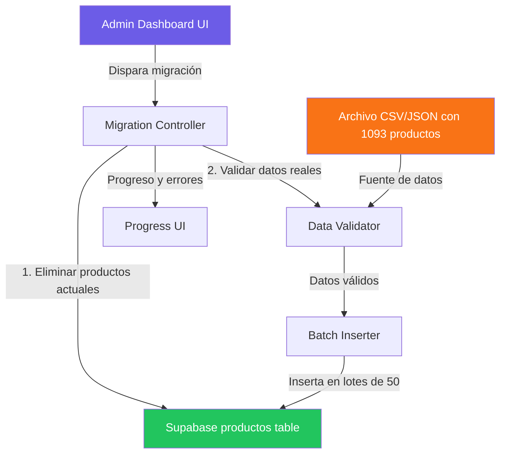
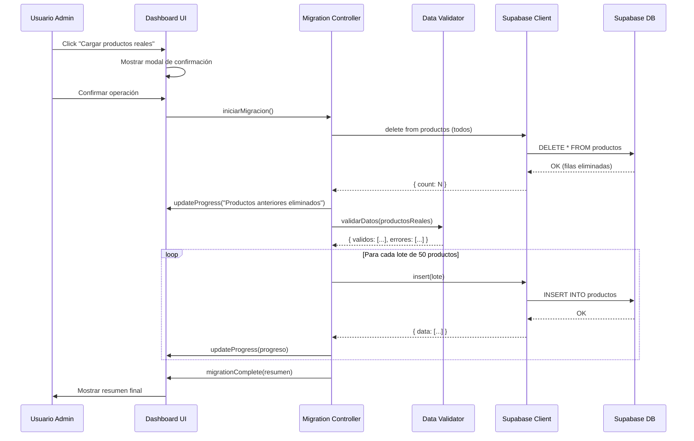
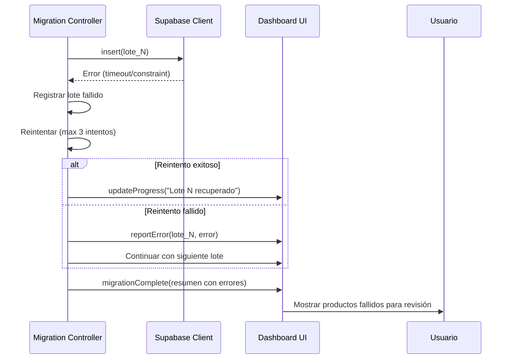

# Design Document: Real Product Inventory

## Overview

Esta funcionalidad permite cargar los 1093 productos reales al sistema de inventario ADDBOX, reemplazando los productos de prueba/placeholder que existen actualmente en la tabla `productos` de Supabase. El proceso incluye: eliminar todos los productos actuales, preparar los datos reales en formato compatible con el esquema de la tabla, e insertarlos en lotes para evitar timeouts y límites de la API de Supabase.

El enfoque es crear un script de migración que se ejecute una sola vez, junto con una interfaz administrativa que permita al usuario disparar la carga desde el dashboard con visibilidad del progreso y manejo de errores.

## Architecture



## Sequence Diagrams

### Flujo Principal: Carga de Productos Reales



### Flujo de Error: Fallo en Inserción de Lote



## Components and Interfaces

### Component 1: Migration Controller

**Propósito**: Orquesta todo el proceso de migración — eliminar datos actuales, validar nuevos datos, e insertar en lotes.

**Interface**:
```javascript
// migration.controller.js
export class MigrationController {
  constructor(supabaseClient, progressCallback) {}
  
  async iniciarMigracion(productosReales) // Punto de entrada principal
  async eliminarProductosActuales()       // Paso 1: Limpieza
  async insertarEnLotes(productos, batchSize) // Paso 2: Inserción
  async reintentarLote(lote, intentos)    // Manejo de reintentos
  getResumen()                            // Resumen final de la operación
}
```

**Responsabilidades**:
- Coordinar el flujo completo de migración
- Manejar reintentos en caso de fallos parciales
- Reportar progreso al UI
- Generar resumen final con estadísticas

### Component 2: Data Validator

**Propósito**: Valida y transforma los datos de productos reales al formato esperado por la tabla `productos` de Supabase.

**Interface**:
```javascript
// data-validator.js
export class DataValidator {
  validarProducto(producto)           // Valida un producto individual
  validarLote(productos)              // Valida array completo
  transformarAlEsquema(productoRaw)   // Mapea campos al esquema de DB
  generarReporteErrores(errores)      // Genera reporte de validación
}
```

**Responsabilidades**:
- Verificar campos requeridos (codigo, descripcion)
- Validar tipos de datos (costo_prom numérico, existencia entero)
- Detectar duplicados por código
- Transformar datos del formato fuente al esquema de Supabase

### Component 3: Batch Inserter

**Propósito**: Maneja la inserción eficiente de grandes volúmenes de datos en Supabase respetando límites de la API.

**Interface**:
```javascript
// batch-inserter.js
export class BatchInserter {
  constructor(supabaseClient, options) {}
  
  async insertBatch(productos)        // Inserta un lote
  async insertAll(productos, batchSize) // Inserta todos en lotes
  getStats()                          // Estadísticas de inserción
}
```

**Responsabilidades**:
- Dividir datos en lotes de tamaño configurable (default: 50)
- Ejecutar inserciones secuenciales para evitar rate limiting
- Manejar errores por lote sin detener el proceso completo
- Registrar estadísticas (insertados, fallidos, tiempo)

### Component 4: Progress UI

**Propósito**: Muestra al usuario el progreso de la migración en tiempo real.

**Interface**:
```javascript
// migration-progress.ui.js
export class MigrationProgressUI {
  mostrarModalConfirmacion(totalProductos)  // Modal de confirmación
  iniciarProgreso(totalLotes)               // Inicia barra de progreso
  actualizarProgreso(loteActual, mensaje)   // Actualiza progreso
  mostrarError(mensaje, detalles)           // Muestra error
  mostrarResumen(resumen)                   // Muestra resumen final
  cerrar()                                  // Cierra el modal
}
```

**Responsabilidades**:
- Mostrar confirmación antes de iniciar (operación destructiva)
- Barra de progreso con porcentaje y mensaje
- Lista de errores si los hay
- Resumen final con estadísticas

## Data Models

### Model 1: Producto (Esquema Supabase `productos`)

```javascript
// Esquema actual de la tabla productos en Supabase
{
  id: "UUID",              // Auto-generado por Supabase
  codigo: "TEXT",          // Código del producto (requerido, único)
  descripcion: "TEXT",     // Descripción del producto (requerido)
  costo_prom: "NUMERIC",  // Costo promedio (requerido)
  estado: "TEXT",          // "activo" | "inactivo" (requerido)
  unidad: "TEXT",          // Unidad de medida (opcional)
  existencia: "INTEGER",  // Cantidad en stock (opcional)
  creado_en: "TIMESTAMPTZ" // Auto-generado
}
```

**Reglas de Validación**:
- `codigo`: No vacío, no duplicado, máximo 50 caracteres
- `descripcion`: No vacío, máximo 255 caracteres
- `costo_prom`: Numérico >= 0
- `estado`: Solo "activo" o "inactivo"
- `existencia`: Entero >= 0 si se proporciona

### Model 2: Producto Raw (Formato de entrada)

```javascript
// Formato esperado del archivo fuente de datos (CSV/JSON)
{
  codigo: "string",        // Código del producto
  descripcion: "string",   // Nombre/descripción
  costo_prom: "number",    // Costo promedio
  estado: "string",        // Estado del producto
  unidad: "string",        // Unidad de medida
  existencia: "number"     // Stock actual
}
```

### Model 3: Migration Result

```javascript
// Resultado de la operación de migración
{
  success: "boolean",           // Si la migración fue exitosa en general
  totalProductos: "number",     // Total de productos a migrar
  insertados: "number",         // Productos insertados correctamente
  fallidos: "number",           // Productos que fallaron
  eliminados: "number",         // Productos anteriores eliminados
  errores: [                    // Lista de errores
    { codigo: "string", mensaje: "string", lote: "number" }
  ],
  tiempoTotal: "number",       // Tiempo en milisegundos
  lotesCompletados: "number",   // Lotes procesados exitosamente
  lotesTotales: "number"        // Total de lotes
}
```


## Key Functions with Formal Specifications

### Function 1: iniciarMigracion()

```javascript
async function iniciarMigracion(productosReales, supabaseClient, onProgress)
```

**Preconditions:**
- `productosReales` es un array no vacío de objetos producto
- `supabaseClient` es una instancia válida y autenticada de Supabase
- `onProgress` es una función callback o null
- Cada producto en `productosReales` tiene al menos `codigo` y `descripcion`

**Postconditions:**
- Todos los productos anteriores han sido eliminados de la tabla `productos`
- Los productos válidos de `productosReales` están insertados en la tabla
- Retorna un objeto `MigrationResult` con estadísticas completas
- Si hay errores parciales, los productos exitosos permanecen insertados
- El callback `onProgress` fue invocado para cada lote procesado

**Loop Invariants:**
- En cada iteración del loop de lotes: `insertados + fallidos + pendientes === totalProductos`
- El progreso reportado nunca decrece

### Function 2: eliminarProductosActuales()

```javascript
async function eliminarProductosActuales(supabaseClient)
```

**Preconditions:**
- `supabaseClient` es una instancia válida y autenticada
- La tabla `productos` existe en Supabase

**Postconditions:**
- La tabla `productos` está vacía (0 filas)
- Retorna el número de productos eliminados
- Si falla, lanza un error y la tabla queda en su estado original (transacción atómica de Supabase)

**Loop Invariants:** N/A (operación atómica)

### Function 3: validarProducto()

```javascript
function validarProducto(producto)
```

**Preconditions:**
- `producto` es un objeto (puede tener campos faltantes o inválidos)

**Postconditions:**
- Retorna `{ valido: true, data: productoTransformado }` si el producto es válido
- Retorna `{ valido: false, errores: [...] }` si el producto es inválido
- No muta el objeto `producto` original
- `productoTransformado` tiene todos los campos mapeados al esquema de Supabase

**Loop Invariants:** N/A (función pura)

### Function 4: insertarEnLotes()

```javascript
async function insertarEnLotes(productos, batchSize, supabaseClient, onProgress)
```

**Preconditions:**
- `productos` es un array de productos ya validados
- `batchSize` es un entero positivo (default: 50)
- `supabaseClient` es una instancia válida
- Todos los productos en el array cumplen el esquema de la tabla

**Postconditions:**
- Retorna `{ insertados: number, fallidos: number, errores: [...] }`
- `insertados + fallidos === productos.length`
- Los productos insertados existen en la tabla de Supabase
- Los errores contienen información del lote y mensaje de error
- El progreso fue reportado para cada lote

**Loop Invariants:**
- `loteProcesado <= totalLotes`
- `insertadosHastaAhora + fallidosHastaAhora === productosProcesadosHastaAhora`
- Cada lote tiene máximo `batchSize` elementos

## Algorithmic Pseudocode

### Algoritmo Principal: Migración de Productos

```javascript
/**
 * ALGORITHM: iniciarMigracion
 * INPUT: productosReales (Array<ProductoRaw>), supabaseClient, onProgress (Function)
 * OUTPUT: MigrationResult
 * 
 * PRECONDITION: productosReales.length > 0 AND supabaseClient is authenticated
 * POSTCONDITION: result.insertados + result.fallidos === productosValidos.length
 */
async function iniciarMigracion(productosReales, supabaseClient, onProgress) {
  const BATCH_SIZE = 50;
  const MAX_RETRIES = 3;
  const resultado = {
    success: false,
    totalProductos: productosReales.length,
    insertados: 0,
    fallidos: 0,
    eliminados: 0,
    errores: [],
    tiempoTotal: 0,
    lotesCompletados: 0,
    lotesTotales: 0
  };

  const inicio = Date.now();

  // PASO 1: Eliminar productos actuales
  onProgress?.({ fase: "eliminando", mensaje: "Eliminando productos actuales..." });
  const { count, error: deleteError } = await supabaseClient
    .from("productos")
    .delete()
    .neq("id", "00000000-0000-0000-0000-000000000000"); // Elimina todos

  if (deleteError) {
    throw new Error(`Error eliminando productos: ${deleteError.message}`);
  }
  resultado.eliminados = count || 0;
  onProgress?.({ fase: "eliminado", mensaje: `${resultado.eliminados} productos eliminados` });

  // PASO 2: Validar todos los productos
  onProgress?.({ fase: "validando", mensaje: "Validando datos..." });
  const productosValidos = [];
  for (const producto of productosReales) {
    const validacion = validarProducto(producto);
    if (validacion.valido) {
      productosValidos.push(validacion.data);
    } else {
      resultado.errores.push({
        codigo: producto.codigo || "SIN_CODIGO",
        mensaje: validacion.errores.join(", "),
        lote: -1
      });
      resultado.fallidos++;
    }
  }

  // PASO 3: Insertar en lotes
  const lotes = dividirEnLotes(productosValidos, BATCH_SIZE);
  resultado.lotesTotales = lotes.length;

  // LOOP INVARIANT: insertados + fallidos + pendientes === productosValidos.length
  for (let i = 0; i < lotes.length; i++) {
    const lote = lotes[i];
    let exito = false;
    let intentos = 0;

    while (!exito && intentos < MAX_RETRIES) {
      intentos++;
      const { data, error } = await supabaseClient
        .from("productos")
        .insert(lote);

      if (!error) {
        resultado.insertados += lote.length;
        resultado.lotesCompletados++;
        exito = true;
      } else if (intentos >= MAX_RETRIES) {
        resultado.fallidos += lote.length;
        resultado.errores.push({
          codigo: `LOTE_${i + 1}`,
          mensaje: error.message,
          lote: i + 1
        });
      } else {
        // Esperar antes de reintentar (backoff exponencial)
        await delay(1000 * intentos);
      }
    }

    onProgress?.({
      fase: "insertando",
      mensaje: `Lote ${i + 1}/${lotes.length} procesado`,
      progreso: ((i + 1) / lotes.length) * 100
    });
  }

  resultado.tiempoTotal = Date.now() - inicio;
  resultado.success = resultado.fallidos === 0;

  // POSTCONDITION ASSERT: insertados + fallidos === totalProductos
  return resultado;
}
```

### Algoritmo de Validación

```javascript
/**
 * ALGORITHM: validarProducto
 * INPUT: producto (Object - puede tener campos faltantes)
 * OUTPUT: { valido: boolean, data?: ProductoTransformado, errores?: string[] }
 * 
 * PRECONDITION: producto is an object (may be malformed)
 * POSTCONDITION: if valido === true then data conforms to DB schema
 *                if valido === false then errores.length > 0
 */
function validarProducto(producto) {
  const errores = [];

  // Validar campos requeridos
  const codigo = String(producto.codigo || "").trim();
  if (!codigo) {
    errores.push("Código es requerido");
  } else if (codigo.length > 50) {
    errores.push("Código excede 50 caracteres");
  }

  const descripcion = String(producto.descripcion || "").trim();
  if (!descripcion) {
    errores.push("Descripción es requerida");
  } else if (descripcion.length > 255) {
    errores.push("Descripción excede 255 caracteres");
  }

  // Validar costo_prom
  const costo = parseFloat(producto.costo_prom);
  if (isNaN(costo) || costo < 0) {
    errores.push("Costo promedio debe ser un número >= 0");
  }

  // Validar estado
  const estado = String(producto.estado || "activo").trim().toLowerCase();
  if (!["activo", "inactivo"].includes(estado)) {
    errores.push("Estado debe ser 'activo' o 'inactivo'");
  }

  // Validar existencia (opcional)
  let existencia = null;
  if (producto.existencia !== null && producto.existencia !== undefined && producto.existencia !== "") {
    existencia = parseInt(producto.existencia);
    if (isNaN(existencia) || existencia < 0) {
      errores.push("Existencia debe ser un entero >= 0");
    }
  }

  if (errores.length > 0) {
    return { valido: false, errores };
  }

  return {
    valido: true,
    data: {
      codigo,
      descripcion,
      costo_prom: costo,
      estado,
      unidad: String(producto.unidad || "").trim() || null,
      existencia
    }
  };
}
```

### Algoritmo de División en Lotes

```javascript
/**
 * ALGORITHM: dividirEnLotes
 * INPUT: array (Array), batchSize (number > 0)
 * OUTPUT: Array<Array> where each sub-array has at most batchSize elements
 * 
 * PRECONDITION: batchSize > 0
 * POSTCONDITION: flatten(output) === input (preserva orden y contenido)
 * LOOP INVARIANT: sum(lotes[0..i].length) === min((i+1)*batchSize, array.length)
 */
function dividirEnLotes(array, batchSize) {
  const lotes = [];
  for (let i = 0; i < array.length; i += batchSize) {
    lotes.push(array.slice(i, i + batchSize));
  }
  return lotes;
}
```

## Example Usage

```javascript
// Ejemplo 1: Cargar productos desde un archivo JSON
import { productosReales } from "./data/productos-reales.json";

const supabase = window.supabaseClient;

const resultado = await iniciarMigracion(productosReales, supabase, (progreso) => {
  console.log(`[${progreso.fase}] ${progreso.mensaje}`);
  if (progreso.progreso) {
    actualizarBarraProgreso(progreso.progreso);
  }
});

console.log(`Migración completada: ${resultado.insertados} insertados, ${resultado.fallidos} fallidos`);

// Ejemplo 2: Uso desde el botón del dashboard
document.getElementById("btn-cargar-reales").addEventListener("click", async () => {
  const confirmado = confirm(
    "⚠️ Esto eliminará TODOS los productos actuales y cargará los 1093 productos reales. ¿Continuar?"
  );
  if (!confirmado) return;

  try {
    const response = await fetch("./data/productos-reales.json");
    const productosReales = await response.json();
    
    const resultado = await iniciarMigracion(productosReales, supabase, actualizarUI);
    mostrarResumen(resultado);
  } catch (error) {
    alert("Error: " + error.message);
  }
});

// Ejemplo 3: Validación individual
const producto = { codigo: "PROD-001", descripcion: "Tinta HP 664", costo_prom: 125.50, estado: "activo" };
const validacion = validarProducto(producto);
// => { valido: true, data: { codigo: "PROD-001", descripcion: "Tinta HP 664", ... } }
```

## Correctness Properties

### Property 1: Eliminación completa antes de inserción

*Para toda* ejecución de `iniciarMigracion`, la tabla `productos` DEBE estar vacía antes de que comience la inserción de nuevos productos. No debe haber mezcla de productos antiguos y nuevos.

**Valida**: Integridad de datos post-migración

### Property 2: Conservación de cantidad

*Para todo* array de productos válidos, `resultado.insertados + resultado.fallidos === productosValidos.length`. Ningún producto se pierde ni se duplica en el conteo.

**Valida**: Completitud de la migración

### Property 3: Validación no muta datos de entrada

*Para todo* producto pasado a `validarProducto()`, el objeto original NO es modificado. La función retorna un nuevo objeto transformado.

**Valida**: Inmutabilidad de datos fuente

### Property 4: Lotes respetan tamaño máximo

*Para todo* resultado de `dividirEnLotes(array, batchSize)`, cada sub-array tiene longitud <= batchSize, y la concatenación de todos los sub-arrays es igual al array original.

**Valida**: Correctitud de la partición

### Property 5: Productos válidos cumplen esquema

*Para todo* producto donde `validarProducto` retorna `{ valido: true }`, el campo `data` contiene exactamente los campos del esquema de Supabase con tipos correctos: `codigo` (string no vacío), `descripcion` (string no vacío), `costo_prom` (number >= 0), `estado` ("activo" | "inactivo").

**Valida**: Compatibilidad con esquema de base de datos

### Property 6: Errores son reportados con contexto

*Para todo* producto que falla validación o inserción, existe una entrada en `resultado.errores` con `codigo`, `mensaje`, y `lote` que identifica el origen del error.

**Valida**: Trazabilidad de errores

### Property 7: Progreso es monótono creciente

*Para toda* secuencia de callbacks `onProgress`, el valor de `progreso.progreso` nunca decrece entre llamadas consecutivas.

**Valida**: Consistencia de la UI de progreso

### Property 8: Reintentos respetan límite máximo

*Para todo* lote que falla, el sistema reintenta máximo `MAX_RETRIES` veces antes de marcarlo como fallido. No hay loops infinitos.

**Valida**: Terminación garantizada

## Error Handling

### Error Scenario 1: Fallo al eliminar productos actuales

**Condición**: La operación DELETE falla (permisos RLS, timeout, conexión)
**Respuesta**: Lanzar error inmediatamente, NO proceder con inserción
**Recuperación**: La tabla queda intacta con los productos originales. El usuario puede reintentar.

### Error Scenario 2: Producto con datos inválidos

**Condición**: Un producto del archivo fuente tiene campos faltantes o tipos incorrectos
**Respuesta**: Registrar en lista de errores, continuar con los demás productos
**Recuperación**: Mostrar reporte de productos inválidos al final para corrección manual

### Error Scenario 3: Fallo de inserción de un lote

**Condición**: Un lote falla por timeout, rate limiting, o constraint violation
**Respuesta**: Reintentar hasta 3 veces con backoff exponencial (1s, 2s, 3s)
**Recuperación**: Si agota reintentos, registrar lote como fallido y continuar con el siguiente

### Error Scenario 4: Archivo de datos no encontrado o corrupto

**Condición**: El archivo JSON/CSV de productos reales no se puede cargar o parsear
**Respuesta**: Mostrar error descriptivo antes de iniciar cualquier operación
**Recuperación**: El usuario debe verificar que el archivo existe y tiene formato correcto

### Error Scenario 5: Duplicados en código de producto

**Condición**: Dos o más productos en el archivo fuente tienen el mismo `codigo`
**Respuesta**: Detectar durante validación, mantener solo la primera ocurrencia
**Recuperación**: Reportar duplicados en el resumen para revisión del usuario

## Testing Strategy

### Unit Testing Approach

- Validar `validarProducto()` con casos específicos: campos vacíos, tipos incorrectos, valores límite
- Validar `dividirEnLotes()` con arrays de diferentes tamaños
- Validar transformación de datos del formato fuente al esquema de DB
- Probar manejo de errores con mocks de Supabase

### Property-Based Testing Approach

**Property Test Library**: `fast-check`

Propiedades a testear:
1. `dividirEnLotes` preserva todos los elementos (round-trip)
2. `validarProducto` nunca muta el input
3. Productos válidos siempre tienen los campos requeridos
4. El conteo de insertados + fallidos siempre suma el total

### Integration Testing Approach

- Test end-to-end con una tabla de prueba en Supabase
- Verificar que la eliminación + inserción funciona como transacción lógica
- Probar con volúmenes reales (1093 productos) para verificar performance
- Probar recuperación ante desconexión de red durante la migración

## Performance Considerations

- **Batch size de 50**: Equilibrio entre velocidad y evitar rate limiting de Supabase
- **Inserción secuencial de lotes**: Evita sobrecargar la API con requests paralelos
- **Tiempo estimado**: ~22 lotes × ~500ms por lote = ~11 segundos para 1093 productos
- **Memoria**: Los 1093 productos en JSON ocupan ~200KB, manejable en el browser
- **Progreso visual**: Actualización por lote (cada ~50 productos) para feedback fluido

## Security Considerations

- **Confirmación obligatoria**: La operación de eliminación masiva requiere confirmación explícita del usuario
- **Solo admins**: La funcionalidad de migración solo debe estar disponible para usuarios con rol admin
- **Validación de datos**: Todos los datos se validan antes de insertar para prevenir inyección
- **No exponer credenciales**: El archivo de datos no debe contener información sensible
- **Audit trail**: Registrar la operación de migración en el log de auditoría existente

## Dependencies

- **Supabase JS Client v1** (ya incluido via CDN en el proyecto)
- **Archivo de datos**: JSON con los 1093 productos reales (debe ser proporcionado por el usuario)
- **Sistema de auditoría existente**: `auditService.js` para registrar la operación
- **UI existente**: Estilos CSS del dashboard, sistema de modales
